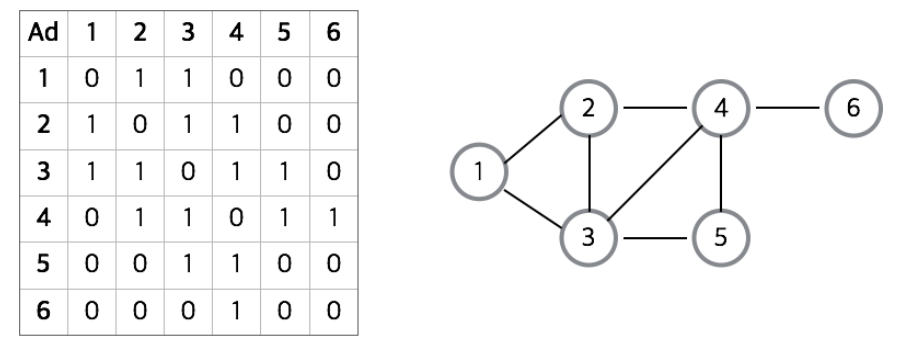
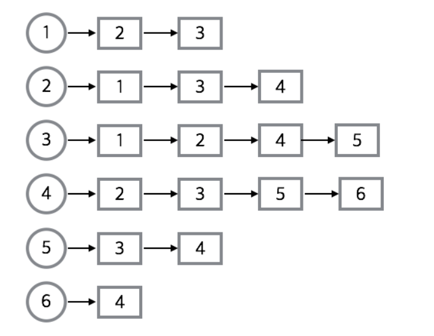
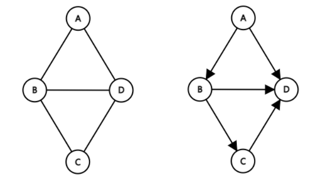
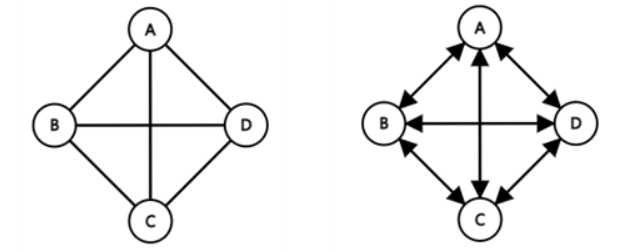
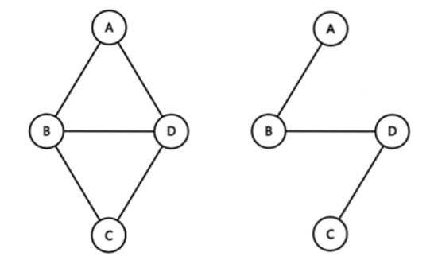
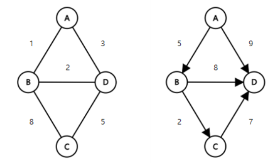
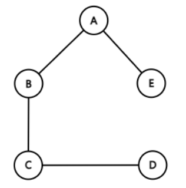
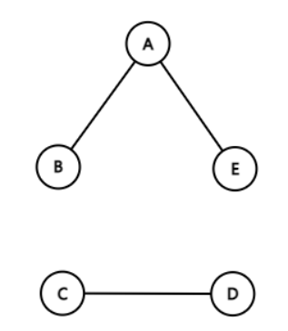

# 그래프 (Graph)

그래프는 vertex와 edge로 구성된 한정된 자료구조를 의미한다. 

vertex는 정점, edge는 정점과 정점을 연결하는 간선이다.

      

## 그래프의 구현

그래프를 구현하는 방법은 인접 행렬과 인접 리스트로 구현하는 2가지 방법이 있다.

 

#### 1. 인접 행렬

2차원 배열을 이용하여 간단하게 그래프를 구현할 수 있다.

구현이 쉽지만 인접 리스트에 비해 공간을 더 많이 차지하며 탐색에 더 많은 시간을 필요로 한다.

 

#### 2. 인접 리스트

위의 그래프를 인접 리스트로 표현한 그림이다.

인접 행렬보다 더 빠른 시간안에 탐색이 가능하며 공간도 더 적게 차지한다.

      

### 그래프와 관련된 용어

* 정점(vertex): 꼭짓점, 위치 (node 라고도 부름)
* 간선(edge): 위치 간의 관계. 즉, 노드를 연결하는 선
* 인접 정점(adjacent vertex): 간선에 의 해 직접 연결된 정점
* 정점의 차수(degree): 무방향 그래프에서 하나의 정점에 인접한 정점의 수
  * 진입 차수(in-degree): 방향 그래프에서 외부에서 오는 간선의 수 (내차수 라고도 부름)
  * 진출 차수(out-degree): 방향 그래픙에서 외부로 향하는 간선의 수 (외차수 라고도 부름)
* 경로 길이(path length): 경로를 구성하는 데 사용된 간선의 수
* 단순 경로(simple path): 경로 중에서 반복되는 정점이 없는 경우
* 사이클(cycle): 단순 경로의 시작 정점과 종료 정점이 동일한 경우

      

## 그래프의 종류

#### 1. 무방향/방향 그래프

 

#### 2. 완전 그래프

모든 정점이 연결되어 최대 간선을 갖는 그래프

 

#### 3. 부분 그래프 (subgraph)

 

#### 4. 가중치 그래프

간선에 가중치가 있는 그래프

 

#### 5. 유향 비순환 그래프 (directed acyclic graph, 줄여서 DAG)

위상정렬이 있는 유향 그래프

(위상정렬은 방향 그래프의 정점들(vertex)을 변의 방향을 거스르지 않도록 나열하는 것을 의미함)

 

#### 6. 연결 그래프

단절 그래프 반대 개념

 

#### 7.  단절 그래프

연결 그래프와 반대됨

 

## References

[사진 출처1](https://medium.com/@gwakhyoeun/til-%EC%9E%90%EB%A3%8C%EA%B5%AC%EC%A1%B0-graph-%EC%9D%B4%ED%95%B4%ED%95%98%EA%B8%B0-6f92fd87a0bd)

[사진 출처2](https://leejinseop.tistory.com/43)