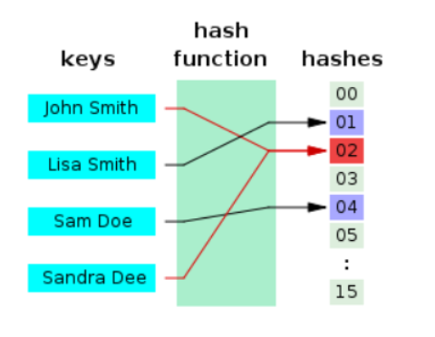

## Java의 HashMap, HashTable

[참고한 블로그](https://d2.naver.com/helloworld/831311)

[참고한 깃헙](https://github.com/wjdrbs96/Today-I-Learn/blob/master/Java/Collection/Map/HashMap%EC%9D%B4%EB%9E%80%3F.md#%ED%95%B4%EC%8B%9C-%EC%B6%A9%EB%8F%8Ccollisions)

<br> <br>

## 연관배열 (Associative array)

연관배열이란 키(key) 1개와 값(value) 1개가 1:1로 연관되어 있는 자료구조이다.


<br> <br>


## 해시테이블 (Hash table)

**해시테이블**은 Hash를 이용하여 연관배열을 구현한 자료구조 이다. 

해시함수를 사용하여 키를 해시값으로 매핑하고, 이 해시값을 인덱스 혹은 주소 삼아 

데이터의 값(value)을 키와 함께 저장하여 검색을 빠르게 하기 위한 자료 구조이다.

<br>


#### Hash가 뭔데 ?

**Hash**(hash code)를 이해하기 위해서는 `Key`, `Hash function`, `Hash code`, `Value`, `Bucket`가 무엇인지 알아야 한다.

* `Key `: 고유한 값, Hash function의 Input이다.
* `Hash function` : Key를 Hash로 변경해주는 역할을 한다.
* `Hash Value ` 또는 `Hash Code` : 해시 함수를 통해 얻는 값으로, 해시를 인덱스 또는 주소로 삼아 Value에 접근이 가능하도록 한다.
* `Value` : Key와 1:1로 매핑되어 있는 값으로 Bucket안에 들어가 있는 실제 값이다.
* `Bucket` : 해시와 매핑되는 값(Value)이 저장되어 있는 공간이다.


<br> <br>


## 해시 충돌

HashMap은 기본적으로 각 객체의 hashCode() 메서드가 반환하는 값을 사용하는데, 결과 자료형은 **int** 이다. 

그런데 32비트 정수 자료형으로는 완전한 자료 해시 함수를 만들 수 없다. 

논리적으로 생성 가능한 객체의 수가 2^32보다 많을 수 있기 때문이며, 또한 모든 HashMap 객체에서 O(1)을 보장하기 위해 랜덤 접근이 가능하게 하려면 원소가 2^32인 배열을 모든 HashMap이 가지고 있어야 하기 때문이다.


c.f) 비둘기집 원리, [생일 문제](https://ko.wikipedia.org/wiki/%EC%83%9D%EC%9D%BC_%EB%AC%B8%EC%A0%9C)

> 아무리 설계를 잘 해도 충돌이 일어날 수 밖에 없다 !!




#### 해시 충돌 처리 방법

> 1. Open Addressing
>
> 2. Separate Chaining

<br>

* **Open Addressing**


<br>

* **Separate Chaining**


<br> <br>

## Open Addressing와 Separate Chaining 비교

Open Addressing는 연속된 공간에 데이터를 저장하기 때문에 데이터 개수가 적으면

캐시적중률(cache hit ratio)이 높아 Separate Chaining보다 성능이 좋다. (데이터가 연속적으로 저장되어 있을 확률이 높기 때문)

하지만 배열의 크기가 커질수록 hit ratio도 낮아지고, 일정 개수 이상으로 데이터가 많아지면 일반적으로 Open Addressing은 Separate Chaining보다 느리다. 버킷을 채운 밀도가 높아질수록 Worst Case발생 빈도가 높아지기 때문이다.

하지만 Separate Chaining를 사용하면 Worst Case발생 빈도를 줄일 수 있도록 설계가 가능하기 때문에 데이터가 많아지면 Separate Chaining이 더 안정적이다. (예를들어 `보조 해시 함수 `가 있다)

게다가 Open Addressing방식은 Linear구조상 데이터를 삭제할때 효율적이기 어렵기 때문에 Java의 HashMap에서는 **Separate Chaining**방식을 채택하여 사용중이다. (remove()메서드는 매우 빈번하게 호출될 수 있기 때문)


<br> <br>

## Separate Chaining In Java

위에서 설명했듯이 `HashSet`, `HashMap` ,`HashTable`은 Separate Chaining방식으로 구현되어 있다.

그렇다면 어떻게 구현되어 있고 어떤 성능을 가질까? get()메소드를 예시로 확인해보자

우선 위의 그림을 다시 참고해 보면, 버킷에서의 Key, value쌍은 위의 그림처럼 링크드 리스트로 저장되어 있다.

버킷(Bucket)의 길이를 N, Key의 개수를 M 이라고 할때, get()메소드의 시간복잡도는 아래와 같다.

<br>

**1. Java8 이전의 get()**

  O(M/N)의 시간복잡도를 가진다.

  자세히 설명하자면, 하나의 버킷에 모든 Key-value쌍이 들어가 있을 경우 N만큼의 시간이 필요하고

  하나의 버킷에 하나의 key-value쌍이 들어가 있거나 헤더에 찾고 있는 key-value쌍이 위치한 경우 1만큼의 시간이 필요하다.

<br>

**2. Java8 이후의 get()**

  데이터 개수가 많아질 경우 링크드 리스트 대신 **트리**를 이용한다.

  따라서 O(log(M/N))의 시간복잡도를 가진다.

  더 자세하게는, 버킷에 할당된 key-value쌍의 개수가 8개전까지는 링크드 리스트를 이용한다.

  8개가 되면 트리구조로 바뀌며 다시 6개로 줄어들면 링크드리스트로 바뀐다.

  트리의 메모리 사용량이 리스트보다 많기 때문에 데이터가 적은 경우 링크드 리스트를 사용하기 위함


<br> <br>

## Bucket에서의 Tree구현

Java 8 HashMap에서는 Entry 클래스 대신 **Node 클래스**를 사용한다. 

Node 클래스 자체는 사실상 Java 7의 Entry 클래스와 내용이 같지만, 링크드 리스트 대신 트리를 사용할 수 있도록 

Node 클래스 하위에 TreeNode 클래스가 있다는 것이 다른점이다.

이때 TreeNode에서 사용하는 트리는 Red-Black Tree인데, Java Collections Framework의 TreeMap과 구현이 거의 같다. 

트리 순회 시 사용하는 대소 판단 기준은 해시 함수 값이다.


<br> <br>

## AVL, Splay등도 있는데 왜 Red-Black Tree ?

`레드-블랙 트리(Red-black tree)`는 자가 균형 이진 탐색 트리(self-balancing binary search tree)로서, 대표적으로는 연관 배열(associative array) 등을 구현하는 데 쓰이는 자료구조다. 레드-블랙 트리는 복잡한 자료구조지만, 실 사용에서 효율적이고, 최악의 경우에도 상당히 우수한 실행 시간을 보인다: 트리에 n개의 원소가 있을 때 O(log n)의 시간복잡도로 삽입, 삭제, 검색을 할 수 있다.

레드-블랙 트리는 자료의 삽입과 삭제, 검색에서 **최악의 경우에도 일정한 실행 시간을 보장**한다(worst-case guarantees). 이는 실시간 처리와 같은 실행시간이 중요한 경우에 유용하게 쓰일 뿐만 아니라, 일정한 실행 시간을 보장하는 또 다른 자료구조를 만드는 데에도 쓸모가 있다. 예를 들면, 각종 기하학 계산에 쓰이는 많은 자료 구조들이 레드-블랙 트리를 기반으로 만들어져 있다.

[출처 - 위키백과](https://ko.wikipedia.org/wiki/%EB%A0%88%EB%93%9C-%EB%B8%94%EB%9E%99_%ED%8A%B8%EB%A6%AC)


<br> <br>

## 해시 버킷 동적 확장

해시 버킷을 적게 사용한다면 초반에 메모리 사용을 절약할 수 있지만, 충돌을 빈번하게 발생할 수 있다는 단점이 있고, 너무 많이 사용하게 되면 메모리 낭비를 할 수도 있다는 단점이 있다.

그래서 Java에서는 특정 %만큼 버킷의 용량이 차면 용량을 2배로 늘리는 방법을 사용한다.

예를들면 HashMap의 default설정으로 **초기용량 16, 로드 팩터가 0.75**인데, 이것은 16의 75%인 12만큼의 데이터가 들어오면 용량을 2배로 늘러 32가 되는 것을 뜻한다. 

이 때 원래 버킷에 있던 것을 새로운 버킷에다 옮기는 과정이 일어나기 때문에 자주 일어난다면 성능상 좋지 않다.

<br>

위의 내용을 좀 더 자세히 설명하자면 아래와 같다.

HashMap은 초기 용량 16, 로드 팩터는 0.75을 기본값으로 가진다.

* `용량 = 버킷 수`

- `로드팩터: 버킷이 얼마나 찼을 때 resize를 하는 것이 좋은지에 대한 값 ex) 0.75 -> 75%`


자바 팀이 설정한 기본값은 대부분의 경우에 잘 최적화되어 있기 때문에 기본값을 사용하는것이 좋지만

HashMap 내부 코드를 보면 위와 같이 `생성자`를 통해서 `초기 용량`, `로드 팩터`를 설정할 수도 있다.

~~~java
public class HashMap<K,V> extends AbstractMap<K,V>
    implements Map<K,V>, Cloneable, Serializable {

    static final int DEFAULT_INITIAL_CAPACITY = 1 << 4; // aka 16

    static final int MAXIMUM_CAPACITY = 1 << 30;

    static final float DEFAULT_LOAD_FACTOR = 0.75f;

    final float loadFactor;

    public HashMap(int initialCapacity, float loadFactor) {

    }

    public HashMap(int initialCapacity) {
    }

    public HashMap() {
        this.loadFactor = DEFAULT_LOAD_FACTOR; // all other fields defaulted
    }
}

~~~


<br>

#### 생성자를 통해 초기용량과 로드팩터를 설정한다면?

- 초기용량을 작게 설정한다면 공간 비용은 절감되지만 재할당 빈도는 증가한다. (재할당시 버킷을 옮기는 과정을 거치기 때문에 성능상 좋지 않다.)

- 초기용량을 크게 설정한다면,

  아래의 식에서 N개의 데이터를 삽입했을 때의 Key-Value쌍 접근 횟수는 2.5N 이므로 

  resize할때 그 만큼 더 큰 수행시간을 필요로 한다.


따라서 적절하게 초기용량과 로드팩터를 설정해야 하는데 그 값이 default값 인것.


<br> <br>

## 보조 해시 함수

그런데 이렇게 해시 버킷 크기를 두 배로 확장하는 것에는 결정적인 문제가 있다. 해시 버킷의 개수 M이 2^a 형태가 되기 때문에, index = X.hashCode() % M을 계산할 때 X.hashCode()의 하위 a개의 비트만 사용하게 된다는 것이다. 즉 해시 함수가 32비트 영역을 고르게 사용하도록 만들었다 하더라도 해시 값을 2의 승수로 나누면 해시 충돌이 쉽게 발생할 수 있다.

이 때문에 **보조 해시 함수**가 필요했다.


`보조 해시 함수(supplement hash function)`의 목적은 '키'의 해시 값을 변형하여, 해시 충돌 가능성을 줄이는 것이다. 이 보조 해시 함수는 JDK 1.4에 처음 등장했는데, Java 5 ~ Java 7은 같은 방식의 보조 해시 함수를 사용하고,  Java 8부터는 다시 새로운 방식의 보조 해시 함수를 사용하고 있다.

~~~java
static final int hash(Object key) { 
    int h; return (key == null) ? 0 : (h = key.hashCode()) ^ (h >>> 16); 
}  
~~~

Java 8 HashMap 보조 해시 함수는 상위 16비트 값을 XOR 연산하는 매우 단순한 형태의 보조 해시 함수를 사용한다. 

이유로는 두 가지가 있는데,

1. Bucket의 트리 구조

   ```
   Java8 부터 해시 충돌이 많이 발생하게 되면 링크드 리스트 대신 트리를 사용하므로 
   해시 충돌 시 발생할 수 있는 성능 문제가 완화되었다.
   ```

2. 해시 함수의 성능 향상

   ```
   최근의 해시 함수는 균등 분포가 잘 되게 만들어지는 경향이 많아, Java 7까지 사용했던 보조 해시 함수의 효과가 크지 않다.
   해당 이유가 좀 더 결정적인 원인이 되어 Java 8에서는 보조 해시 함수의 구현이 바뀌게 된것이다.
   ```


<br> <br>


## Java의 HashMap, ConCurrentHashMap, HashTable 차이점

HashMap, ConCurrentHashMap, HashTable 이 3가지 클래스는 Map 인터페이스를 구현한 컬렉션이다.

기본적으로 <key,value>구조를 가지고있지만, key,value값의 null 허용여부와 속도,동기화보장 등은 서로서로 조금씩 다르다.


<br> 

**1. HashMap**

HashMap은 synchronized 키워드가 없기 때문에 `동기화가 보장되지 못한다`. (싱글 스레드 환경에서 사용해야 함) 

따라서 동기화처리를 하지 않기 때문에 값을 찾는 속도가 상당히 빠르다. 또한 HashTable과 다르게 key,value에 `null값을 허용`한다. 

즉, 속도가 빠르지만 신뢰성과 안정성은 떨어진다고 생각하면 된다.

HashMap은 위에서 설명한 `보조해시 함수`를 사용하기 때문에 HashTable에 비해 해시 충돌(hash collision)이 덜 발생할 수 있어 상대적으로 성능상 이점이 있음

<br> 

**2. HashTable**

`thread-safe`

key,value에 `null을 허용하지 않는다`.

HashMap의 멀티스레드 환경에서의 동기화처리로 인한 문제점을 보완한 것이 HashTable.

HashTable의 메소드는 전부 synchronized 키워드가 붙어있기 때문에 메소드 호출 전 쓰레드간 동기화 락을 통해 멀티 쓰레드 환경에서 data의 무결성을 보장해준다.

동기화 락때문에 속도는 느리지만, data의 안정성이 높고 신뢰가 높음

<br> 

**3. ConcurrentHashMap**

`thread-safe`

key,value에 `null을 허용하지 않는다`.

HashTable과 동일한 기능을 갖는다.

java5 에서 HashTable의 성능을 향상시켜 나온것이 ConcurrentHashMap이다.
