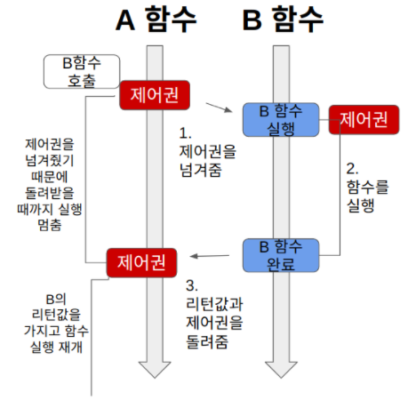
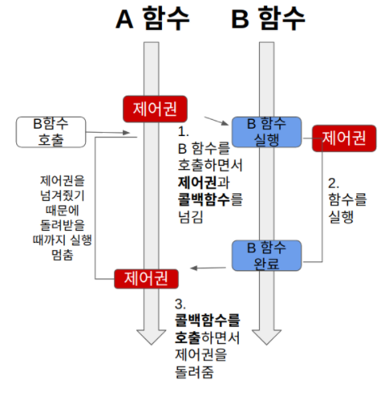
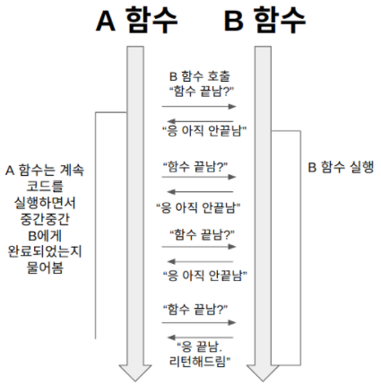
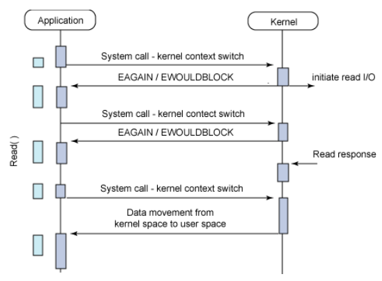
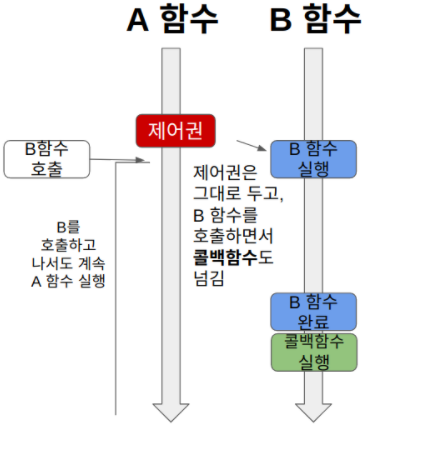

# Blocking,Non-blocking & Synchronous,Asynchronous
* [출처 블로그 1](https://musma.github.io/2019/04/17/blocking-and-synchronous.html)
* [출처 블로그 2](https://velog.io/@nittre/%EB%B8%94%EB%A1%9C%ED%82%B9-Vs.-%EB%85%BC%EB%B8%94%EB%A1%9C%ED%82%B9-%EB%8F%99%EA%B8%B0-Vs.-%EB%B9%84%EB%8F%99%EA%B8%B0)

<br> <br>

## Blocking과 Non-blocking
* 제어권 ?
    ```
    제어권은 자신(함수)의 코드를 실행할 권리 같은 것이다. 
    제어권을 가진 함수는 자신의 코드를 끝까지 실행한 후, 자신을 호출한 함수에게 돌려준다.
    ```

* **Block** : 행위자가 **막혀버린, 제한된, 대기하는 상태**
    ```
    <호출된 함수>가 자신이 할 일을 모두 마칠 때까지 제어권을 계속 가지고서 
    [호출한 함수]에게 바로 돌려주지 않으면 Block 
    즉, [호출한 함수]가 block
    ```
* **Non-block**
    ```
    <호출된 함수>가 자신이 할 일을 채 마치지 않았더라도 바로 제어권을 건네주어(return)
    [호출한 함수]가 다른 일을 진행할 수 있도록 해주면 Non-block
    ```

<br> <br>

## Synchronous와 Asynchronous
* **Synchronous** : 동시 발생하는 - (**always plural**, **can never be singular**)
    ```
    <호출된 함수>의 수행 결과 및 종료를 
    [호출한 함수]가(<호출된 함수>뿐 아니라 [호출한 함수]도 함께) 신경 쓰면 Synchronous
    즉, [호출한 함수]와 <호출된 함수>가 함께 작업완료를 신경씀
    ```

* **Asynchronous**
    ```
    <호출된 함수>의 수행 결과 및 종료를 
    <호출된 함수>가 혼자 직접 신경 쓰고 처리한다면(as a callback fn.) Asynchronous
    ```

<br> <br>

## Blocking,Non-blocking & Synchronous,Asynchronous 관계비교 실생활 예시

#### 예시 상황 : 대표님, 개발자 좀 더 뽑아주세요.
> 1,4번이 익숙한 예시임
1. Blocking & Synchronous
2. Blocking & Asynchronous
3. Non-blocking & Synchronous
4. Non-blocking & Asynchronous

<br>

### 1. Blocking & Synchronous
```
나 : 대표님, 개발자 좀 더 뽑아주세요..
대표님 : 오케이, 잠깐만 거기 계세요!
나 : …?!!
대표님 : (채용 공고 등록.. 지원자 연락.. 면접 진행.. 연봉 협상..)
나 : (과정 지켜봄.. 궁금함.. 어차피 내 일 하러는 못 가고 계속 서 있음)
```



<br>

### 2. Blocking & Asynchronous
```
나 : 대표님, 개발자 좀 더 뽑아주세요..
대표님 : 오케이, 잠깐만 거기 계세요!
나 : …?!!
대표님 : (채용 공고 등록.. 지원자 연락.. 면접 진행.. 연봉 협상..)
나 : (안 궁금함.. 지나가는 말로 여쭈었는데 붙잡혀버림.. 딴 생각.. 못 가고 계속 서 있음)
```

* A 함수는 자신과 관련 없는 B 함수의 작업이 끝날 때까지 단순히 기다려야 한다.


<br>

### 3. Non-blocking & Synchronous
```
나 : 대표님, 개발자 좀 더 뽑아주세요..
대표님 : 알겠습니다. 가서 볼 일 보세요.
나 : 넵!
대표님 : (채용 공고 등록.. 지원자 연락.. 면접 진행.. 연봉 협상..)
나 : 채용하셨나요?
대표님 : 아직요.
나 : 채용하셨나요?
대표님 : 아직요.
나 : 채용하셨나요?
대표님 : 아직요~!!!!!!
```

* Non-blocking & Synchronous 예시 그림 1


* Non-blocking & Synchronous 예시 그림2


<br>

### 4. Non-blocking & Asynchronous
```
나 : 대표님, 개발자 좀 더 뽑아주세요..
대표님 : 알겠습니다. 가서 볼 일 보세요.
나 : 넵!
대표님 : (채용 공고 등록.. 지원자 연락.. 면접 진행.. 연봉 협상..)
나 : (열일중..)
대표님 : 한 분 모시기로 했습니다~!
나 : 😍
```

* B 함수는 자신의 작업이 끝나면 A 함수가 준 콜백 함수를 실행하여 결과를 반환한다.
