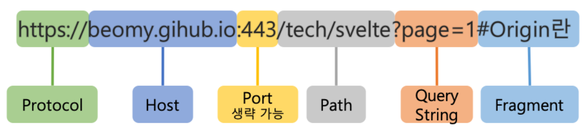

[출처 블로그](https://beomy.github.io/tech/browser/cors/)

## CORS (Cross-Origin Resource Sharing)
> 교차 출처 리소스 공유
* 브라우저에서 다른 출처의 리소스를 공유하는 방법

 

### URL 구조
> scheme://[userinfo@]host[:port][/path][?query][#fragment]

* 예시: https://www.google.com:443/search?q=hello&hl=ko
    * 프로토콜 (scheme: `https`)
    * 호스트명 (host: `www.google.com`)
    * 포트 번호 (port: `443`)
    * 패스 (path: `/search`)
    * 쿼리 파라미터 (query: `q=hello&hl=ko`)

* 예시 2

 

### CORS의 O, Origin(출처)이란?
위의 URL의 구조에서 **Protocal, Host, Port**를 합친 것을 말함

 

#### 같은 출처 VS 다른 출처
* 현재 웹페이지의 주소가 `https://beomy.github.io/tech/`일때 같은 출처인지 다른 출처인지 아래 테이블과 같은 결과를 얻을 수 있음.

| URL |	결과 | 이유 |
|:------:|:----:|:---------:|
| https://beomy.github.io/about | 같은 출처 | Protocal, Host, Port 동일 |
| https://beomy.github.io/about?q=work | 같은 출처 | Protocal, Host, Port 동일 |
| https://beomy.github.io/about#work | 같은 출처 | Protocal, Host, Port 동일 |
| http://beomy.github.io | 다른 출처 | Protocal 다름 |
| https://beomy.github.io:81/about | 다른 출처 |Port 다름 |
| https://beomy.heroku.com | 다른 출처 | Host 다름 |

 

#### 동일 출처 정책(SOP: Same-Origin Policy)과 장단점
* 동일 출처 정책은 다른 출처의 리소스의 접근을 금지하는것이다.
* XSS나 XSRF등 보안 취약점을 노린 공격을 방어할 수 있다는 장점이 있다.
* 다른 서버에서의 데이터를 요청하는것과 같이 외부 리소스를 참고하는것이 빈번하기 때문에 그 방법이 존재해야 한다.

 

#### CORS
~~~
동일 출처 정책(SOP)에서 설명했듯이 외부 리소스를 사용할 방법이 필요하기 때문에 
외부 리소스를 사용하기 위한 SOP의 예외 조항 CORS가 있다.
~~~

#### CORS 동작원리
> CORS의 동작 방식은 단순 요청 방법과 예비 요청을 먼저 보내는 방법 2가지가 있다.
1. Simple request
2. Preflight request

 

* 자세한 동작원리 및 CORS오류 해결 방법 : [해당 블로그 참고](https://beomy.github.io/tech/browser/cors/)