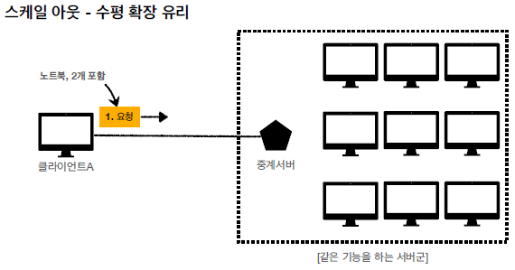
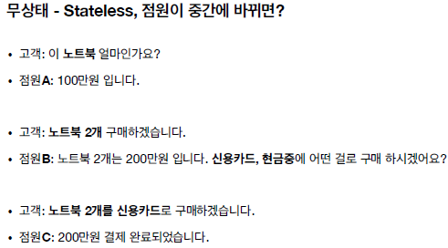
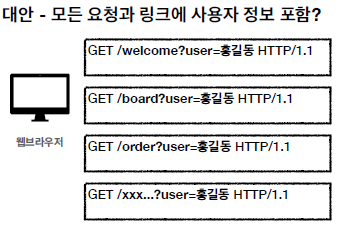
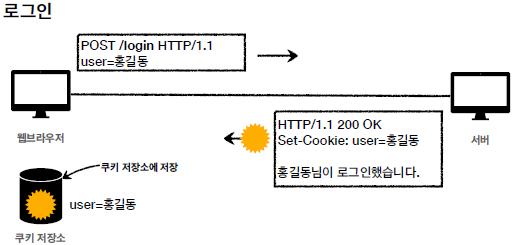
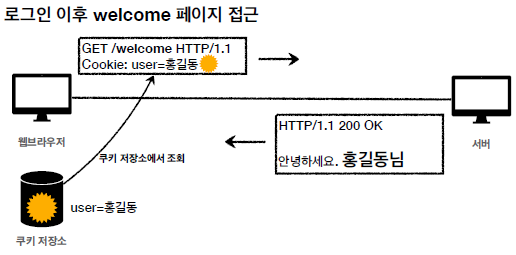

# Cookie & Session

 

## Stateless 와 Connectionless
* HTTP는 무상태(Stateless) 그리고 비연결성(Connectionless) 프로토콜이다.
* 클라이언트와 서버가 요청과 응답을 주고 받으면 연결이 끊어진다.
* 클라이언트가 다시 요청하면 서버는 이전 요청을 기억하지 못한다.
* 클라이언트와 서버는 서로 상태를 유지하지 않는다.

**무상태 (Stateless)**
* 서버가 클라이언트의 상태를 보존X
* 장점: 서버 확장성 높음(스케일 아웃)
* 단점: 클라이언트가 추가 데이터 전송

 

 

**Stateless의 한계**
* 모든 것을 무상태로 설계 할 수 있는 경우도 있고 없는 경우도 있다.
    * 무상태 예시 - 로그인이 필요 없는 단순한 서비스 소개 화면
    * 상태 유지 예시 - 로그인
* 로그인한 사용자의 경우 로그인 했다는 상태를 서버에 유지
* 일반적으로 브라우저 쿠키와 서버 세션등을 사용해서 상태 유지
* 상태 유지는 최소한만 사용

 

**비연결성 Connectionless**
* HTTP는 기본이 연결을 유지하지 않는 모델
* 일반적으로 초 단위의 이하의 빠른 속도로 응답
* 1시간 동안 수천명이 서비스를 사용해도 실제 서버에서 동시에 처리하는 요청은 수십개 이하로 매우 작음
* 예) 웹 브라우저에서 계속 연속해서 검색 버튼을 누르지는 않는다.
* 서버 자원을 매우 효율적으로 사용할 수 있음

 

**비연결성의 한계와 극복**
* TCP/IP 연결을 새로 맺어야 함 - 3 way handshake 시간 추가
* 웹 브라우저로 사이트를 요청하면 HTML 뿐만 아니라 자바스크립트, css, 추가 이미지등 수 많은 자원이 함께 다운로드
* 지금은 HTTP 지속 연결(Persistent Connections)로 문제 해결
* HTTP/2, HTTP/3에서 더 많은 최적화

****

## 쿠키(Cookie) & 세션(Session)

### 쿠키(Cookie)
* Set-Cookie: 서버에서 클라이언트로 쿠키 전달(응답)
* Cookie: 클라이언트가 서버에서 받은 쿠키를 저장하고, HTTP 요청시 서버로 전달

 

### 쿠키의 배경 - Stateless
* HTTP는 무상태(Stateless) 그리고 비연결성(Connectionless) 프로토콜이다.
* 클라이언트와 서버가 요청과 응답을 주고 받으면 연결이 끊어진다.
* 클라이언트가 다시 요청하면 서버는 이전 요청을 기억하지 못한다.
* 클라이언트와 서버는 서로 상태를 유지하지 않는다.
* 대안으로 모든 HTTP 요청에 클라이언트의 정보를 포함해서 보내면 여러가지 문제가 발생
    * 모든 요청에 사용자 정보가 포함되도록 개발 해야함 (개발 힘듦)
    * 브라우저를 완전히 종료하고 다시 열면?
    * 보안 취약

   

### 쿠키(Cookie)의 동작방식

 

   

### 쿠키 특징

* 사용처
    * 사용자 로그인 세션 관리
    * 광고 정보 트래킹
* 쿠키 정보는 항상 서버에 전송됨
    * 네트워크 트래픽 추가 유발(쿠키에 필요한 많은 정보들)
    * 따라서 최소한의 정보만 사용(세션 id, 인증 토큰(`ex`: Oauth)...)
    * 서버에 전송하지 않고, 웹 브라우저 내부에 데이터를 저장하고 싶으면 웹 스토리지 (localStorage, sessionStorage) 참고
        * 서버에 불필요한 데이터 전송을 줄이고 웹 스토리지에 저장 후 클라이언트 로직에서만 사용
* 주의!
    * 보안에 민감한 데이터는 저장하면 안됨(주민번호, 신용카드 번호 등등)

   

### 쿠키의 구성요소 - 모든 요청에 모든 쿠키 정보를 포함해야 할까?
* 위의 로그인 그림에서 대충 설명한 set-cookie에는 아래와 같은 제약정보가 포함이 됨
    * **set-cookie**: `sessionId`=abcde1234; `expires`=Sat, 26-Dec-2020 00:00:00 GMT; `path`=/; `domain`=.google.com; `Secure`
    1. `sessionId`=abcde1234; 
    2. `expires`=Sat, 26-Dec-2020 00:00:00 GMT; 
    3. `path`=/; 
    4. `domain`=.google.com; 
    5. `Secure`

 

#### 1. 쿠키 - 세션ID
> SessionId
* 각각의 쿠키를 구별하는데 사용하는 ID

 

#### 2. 쿠키 - 생명주기
> Expires, max-age
* Set-Cookie: expires=Sat, 26-Dec-2020 04:39:21 GMT
    * 만료일이 되면 쿠키 삭제
* Set-Cookie: max-age=3600 (3600초)
    * 초단위로 쿠키의 생명주기 설정
    * 0이나 음수를 지정하면 쿠키 삭제
* 생명주기에 따른 **쿠키의 종류** 
    1. 세션 쿠키: 만료 날짜를 생략하면 브라우저 종료시 까지만 유지 (일반적으로 알고있는 세션과는 관계없음, 서버와 관계없음!)
    2. 영속 쿠키: 만료 날짜를 입력하면 해당 날짜까지 유지

 

#### 3. 쿠키 - 경로
> Path
* 예시) `path`=/home
* 이 경로를 포함한 하위 경로 페이지만 쿠키 접근
* 일반적으로 path=/ 루트로 지정 (모든 루트 쿠키 접근)
* 예시)
    * `path`=/home 지정
    * /home -> 가능
    * /home/level1 -> 가능
    * /home/level1/level2 -> 가능
    * /hello -> 불가능

 

#### 4. 쿠키 - 도메인
> Domain
* 예) `domain`=example.org
* **명시**: 명시한 문서 기준 도메인 + 서브 도메인 포함
    * `domain`=example.org를 지정해서 쿠키 생성
        * example.org는 물론이고
        * dev.example.org도 쿠키 접근
* **생략**: 현재 문서 기준 도메인만 적용
    * example.org 에서 쿠키를 생성하고 domain 지정을 생략
        * example.org 에서만 쿠키 접근
        * dev.example.org(하위 도메인)는 쿠키 미접근

 

#### 5. 쿠키 - 보안
> Secure, HttpOnly, SameSite
* Secure
    * Secure사용하지 않으면, 쿠키는 http, https를 구분하지 않고 전송
    * Secure를 적용하면 https인 경우에만 전송
* HttpOnly
    * XSS 공격 방지
    * -> 자바스크립트에서 접근 불가(document.cookie)
    * 즉, HTTP 전송에만 사용되도록 함
* SameSite
    * XSRF 공격 방지
    * 요청 도메인과 쿠키에 설정된 도메인이 같은 경우만 쿠키 전송 (원래는 달라도 쿠기 전송가능)

       

### 세션 (Session)
* **세션은 쿠키를 기반으로 함**
* 쿠키는 브라우저에 사용자 정보를 저장하지만 **세션은 서버 측에서 관리**
* 서버에서 클라이언트를 구분하기 위해 세션 ID를 부여하며 웹 브라우저가 서버에 접속해서 브라우저를 종료할 때까지 인증상태를 유지
* 접속 시간에 제한을 두어 일정 시간 응답이 없다면 정보가 유지되지 않게 설정이 가능
* 사용자에 대한 정보를 서버에 두기 때문에 쿠키보다 보안에 좋지만, 사용자가 많아질수록 서버 메모리를 많이 차지함
* 동접자 수가 많은 웹 사이트인 경우 서버에 과부하를 주게 되므로 성능 저하의 요인이 될 수 있음

 

#### 세션의 동작 방식
1. 클라이언트가 서버에 접속 시 세션 ID를 발급 받음
2. 클라이언트는 세션 ID에 대해 쿠키를 사용해서 저장하고 가지고 있음
3. 클라리언트는 서버에 요청할 때, 이 쿠키의 세션 ID를 같이 서버에 전달해서 요청
4. 서버는 세션 ID를 전달 받아서 별다른 작업없이 세션 ID로 세션에 있는 클라언트 정보를 가져와서 사용
5. 클라이언트 정보를 가지고 서버 요청을 처리하여 클라이언트에게 응답

 

#### 세션의 특징
* 각 클라이언트에게 고유 ID를 부여
* 세션 ID로 클라이언트를 구분해서 클라이언트의 요구에 맞는 서비스를 제공
* 보안 면에서 쿠키보다 우수
* 사용자가 많아질수록 서버 메모리를 많이 차지하게 됨

 

#### 세션의 사용 예시
* 로그인 같이 보안상 중요한 작업을 수행할 때 사용

 

#### 쿠키와 세션의 차이
1. 가장 큰 차이점은 사용자의 정보가 저장되는 위치
    * 쿠키는 클라이언트에 저장
    * 세션은 서버에 저장
2. 만료시점
    * 쿠키는 생성시 만료일을 설정, 브라우저가 종료되어도 삭제되지 않을 수 있음
    * 세션은 쿠키와 같이 만료일을 설정할 수 있지만 브라우저 종료시 삭제됨
3. 쿠키가 세션보다 빠르다.
4. 세션이 쿠키보다 보안이 좋다.

 

#### 왜 쿠키를 사용할까?
~~~
세션은 서버의 자원을 사용하기 때문에 무분별하게 만들다보면 
서버의 메모리가 감당할 수 없어질 수가 있고 속도가 느려질 수 있기 때문에
쿠키가 더 효과적일수 있음
~~~
