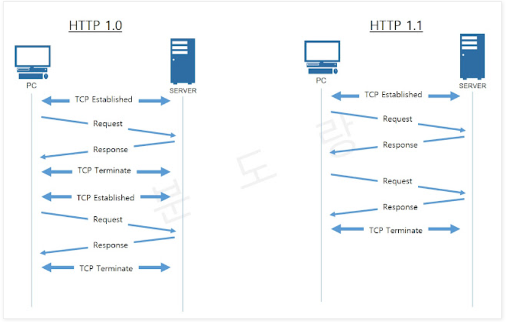
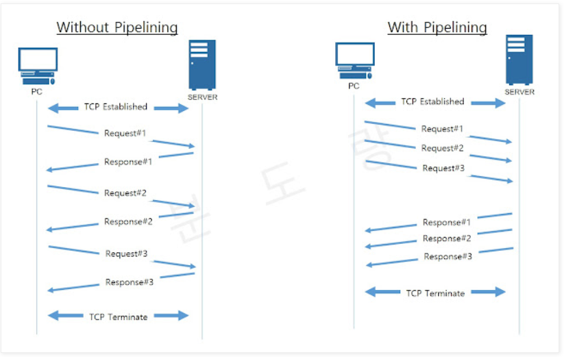
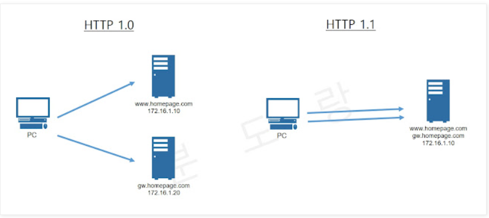

# HTTP (HyperText Transfer Protocol)
> HTTP 메시지에 모든 것을 전송가능

* HTML, TEXT
* IMAGE, 음성, 영상, 파일
* JSON, XML (API)
* 거의 모든 형태의 데이터 전송 가능
* 서버간에 데이터를 주고 받을 때도 대부분 HTTP 사용
    (`TMI: ` TCP위에 HTTP가 있기 때문에 TCP를 직접 사용하지는 않음, 게임서버의 경우 TCP를 직접 사용하기도 함)

   

***

## HTTP 버전 1.0/1.1/2/3 차이점
**HTTP의 역사**
* HTTP/0.9 1991년: GET 메서드만 지원, HTTP 헤더X
* HTTP/1.0 1996년: 메서드, 헤더 추가
* HTTP/1.1 1997년: 가장 많이 사용, 우리에게 가장 중요한 버전
* HTTP/2 2015년: 성능 개선
* HTTP/3 진행중: TCP 대신에 UDP 사용, 성능 개선

   

### HTTP/1.0 vs HTTP/1.1
> HTTP 1.1의 특징을 토대로 차이점을 설명
> [참고링크](https://withbundo.blogspot.com/2021/02/http-http-10-http-11.html)

**HTTP 1.1의 큰 특징**
1. 커넥션 유지 (Persistent Connection)
2. 호스트 헤더 (Host Header)
3. 강력한 인증 절차 (Improved Authentication Procedure)

 

#### 1. 커넥션 유지
~~~
HTTP를 이용한 데이터 전달은 TCP세션 기반에서 이루어진다.
HTTP 1.1에서는 1.0과는 달리 TCP세션을 지속적으로 유지할 수 있는데에 차이가 있다.
~~~

 

> 커넥션 유지와 함께 HTTP 1.1에서 지원되는 기능이 하나 더 있다.

**파이프라이닝 (Pipelining)**
~~~
HTTP 요청은 순차적으로 이루어 지는데 파이프라이닝을 이용하면
아래의 그림처럼 같은 TCP세션에서 동시에 요청을 여러개 보내고 이에 대한 각각의 응답을 받아 처리할 수 있다.
~~~

커넥션 유지와 파이프라이닝을 통해 응답속도를 높여 뷰의 로딩속도를 빠르게 할 수 있다.

 

#### 2. 호스트 헤더
~~~
HTTP 1.0 에서는 하나의 IP에 여러 도메인을 운영할 수 없지만
HTTP 1.1 부터는 Host 헤더의 추가를 통해 버츄얼 호스팅이 가능해 졌다.
~~~

 

#### 3. 강력한 인증 절차
~~~
HTTP 1.0에서도 클라이언트의 인증을 요구하는 헤더(www-authentication)는 지원되어 왔으나
클라이언트와 서버 사이에 프록시가 위치하는 경우 사용자의 인증을 요구할 수 있는 방법이 없었다.
HTTP 1.1에서는 아래의 두 헤더를 통해 해결이 가능하다.

• proxy-authentication
• proxy-authorization
~~~

   

### HTTP/2.0
> HTTP/2 는 HTTP/1.1의 속도를 향상한 버전이다. 응답속도 측면에서 많은 개선이 있었다.

   

# -미완-