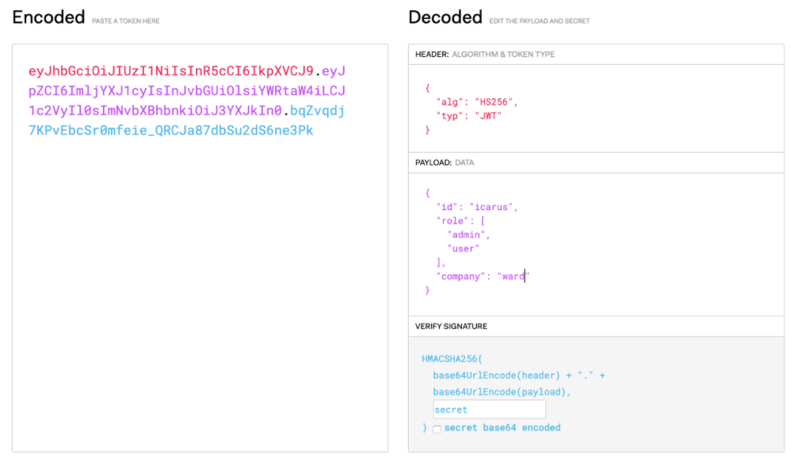
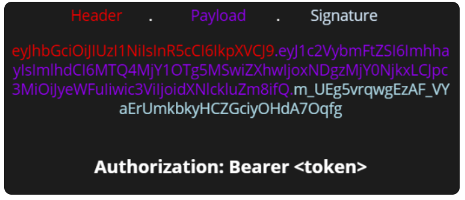

### JWT란 ?
~~~
JWT (JSON Web Token)는 Json 포맷을 이용하여 사용자에 대한 속성을 저장하는 Claim 기반의 Web Token이다.
가볍고(compact) 자체적으로 필요한 정보를 담는(self-contained) 방식으로, 
서버와 클라이언트 사이에서 JSON 객체를 빠르고 안전하게 전달한다.
~~~

### JWT의 구조
> 아래의 3가지로 구성되어 있으며 '.'으로 3가지가 구분된다.
* Header
* PayLoad
* Signature

   

* JWT예시1 - [출처](https://icarus8050.tistory.com/12)

* JWT예시2 - [출처](https://mangkyu.tistory.com/56)

 

#### Header
헤더에는 일반적으로 두 가지의 요소로 이루어져있다.
* `typ` : "JWT" 같은 토큰의 타입을 기술합니다.
* `alg` : 알고리즘 방식을 지정하며, 서명(Signature) 및 토큰 검증에 사용 ex) HS256(SHA256) 또는 RSA
* 예시
~~~json
{ 
    "alg": "HS256", 
    "typ": JWT 
}
~~~

   

#### PayLoad
~~~
토큰의 페이로드에는 토큰에서 사용할 정보의 조각들인 클레임(Claim)이 담겨 있다. 
클레임은 총 3가지로 나누어지며, Json(Key/Value) 형태로 다수의 정보를 넣을 수 있다.
~~~

**1. 등록된 클레임(Registered Claim)**
등록된 클레임은 토큰 정보를 표현하기 위해 이미 정해진 종류의 데이터들로, 모두 선택적으로 작성이 가능하며 사용할 것을 권장한다. 또한 JWT를 간결하게 하기 위해 key는 모두 길이 3의 String이다. 여기서 subject로는 unique한 값을 사용하는데, 사용자 이메일을 주로 사용한다.

* `iss`: 토큰 발급자(issuer)
* `sub`: 토큰 제목(subject)
* `aud`: 토큰 대상자(audience)
* `exp`: 토큰 만료 시간(expiration), NumericDate 형식으로 되어 있어야 함 ex) 1480849147370
* `nbf`: 토큰 활성 날짜(not before), 이 날이 지나기 전의 토큰은 활성화되지 않음
* `iat`: 토큰 발급 시간(issued at), 토큰 발급 이후의 경과 시간을 알 수 있음
* `jti`: JWT 토큰 식별자(JWT ID), 중복 방지를 위해 사용하며, 일회용 토큰(Access Token) 등에 사용
 
 

**2. 공개 클레임(Public Claim)**
> 공개 클레임은 사용자 정의 클레임으로, 공개용 정보를 위해 사용된다. 
> 충돌 방지를 위해 URI 포맷을 이용하며, 예시는 아래와 같다.
~~~json
{ 
    "https://mangkyu.tistory.com": true
}
~~~
 

**3. 비공개 클레임(Private Claim)**
> 비공개 클레임은 사용자 정의 클레임으로, 서버와 클라이언트 사이에 임의로 지정한 정보를 저장한다. 아래의 예시와 같다.
~~~json
{ 
    "token_type": access 
}
~~~

   

#### Signature
~~~
서명(Signature)은 토큰을 인코딩하거나 유효성 검증을 할 때 사용하는 고유한 암호화 코드이다. 
서명(Signature)은 위에서 만든 헤더(Header)와 페이로드(Payload)의 값을 각각 BASE64로 인코딩하고, 
인코딩한 값을 비밀 키를 이용해 헤더(Header)에서 정의한 알고리즘으로 해싱을 하고, 이 값을 다시 BASE64로 인코딩하여 생성한다.
~~~
