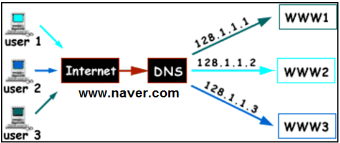

# Load Balancing과 AWS의 Load Balancer 그리고 DNS Round Robin
* [출처 블로그1](https://dev.classmethod.jp/articles/load-balancing-types-and-algorithm/)
* [출처 블로그2](https://no-easy-dev.tistory.com/entry/AWS-ALB%EC%99%80-NLB-%EC%B0%A8%EC%9D%B4%EC%A0%90)
* [출처 블로그3](https://velog.io/@dbstjrwnekd/DNS-Round-Robin)
* [출처 블로그4](https://m.blog.naver.com/sehyunfa/221691155719)

## 로드 밸런싱(Load balancing)이란?
```
부하분산 또는 로드 밸런싱(load balancing)은 컴퓨터 네트워크 기술의 일종으로 
둘 혹은 셋이상의 중앙처리장치 혹은 저장장치와 같은 컴퓨터 자원들에게 작업을 나누는 것을 의미한다.

즉, 여러 서버가 작업을 분산 처리 하는것을 로드 밸런싱이라고 한다.
가용성 및 응답시간을 최적화 시킬 수 있다.

* 가용성(Availability) : 서버와 네트워크, 프로그램 등의 정보 시스템이 정상적으로 사용 가능한 정도
```

<br> <br>

## 로드 밸런서(LB: Load balancer)란 ?
```
하나의 인터넷 서비스가 발생하는 트래픽이 많을 때,
여러 대의 서버가 분산 처리하여 서버의 로드율 증가, 부하량, 속도 저하 등을 고려하여
적절히 분산 처리하여 해결해주는 서비스

즉, 로드 밸런싱 기술을 제공하는 서비스이다.
```

* 아래의 그림처럼 클라이언트와 서버의 사이에서 트래픽을 분산하는(로드밸런싱을 하는) 장치를 로드밸런서라고 한다.
    


<br> <br>

## AWS 로드 밸런서의 종류
```
AWS 서비스를 사용하다보면 자주 접하게 되는 서비스가 로드 밸런싱이다.
AWS의 로드 밸런서(LB: Load balancer)는 OSI 7 계층 중 어느 계층에서 동작하는지에 따라 
NLB(Network LoadBalancer)와 ALB(Application LoadBalancer)로 나눌 수 있다. 
기존에는 CLB(Classic LoadBalancer)도 있었지만, 현재에는 거의 사용하지 않고 주로 NLB 또는 ALB를 사용하고 있다.
```

* NLB(`L4 LB`) : **Transport 계층**을 사용, IP 주소와 포트 번호 부하 분산이 가능
* ALB(`L7 LB`) : **Application 계층**을 사용, URL 또는 HTTP 헤더에서 부하 분산이 가능
* L4, L7은 OSI 7계층에서 Layer 4, Layer 7을 나타내며 각각 Transport계층, Application계층에 해당함

* 참고: OSI 7계층
    

<br>

## AWS LB: ALB와 NLB 차이점
> 직접 사용해봐야 차이점을 느낄 수 있을것 같음

### ALB
1. ALB는 L7단의 로드 밸런서를 지원합니다.
2. ALB는 HTTP/HTTPS 프로토콜의 헤더를 보고 적절한 패킷으로 전송합니다.
3. ALB는 IP주소 + 포트번호 + 패킷 내용을 보고 스위칭합니다.
4. ALB는 IP 주소가 변동되기 때문에 Client에서 Access 할 ELB의 DNS Name을 이용해야 합니다.
5. ALB는 L7단을 지원하기 때문에 SSL 적용이 가능합니다.

### NLB
1. NLB는 L4단의 로드 밸런서를 지원합니다.
2. NLB는 TCP/IP 프로토콜의 헤더를 보고 적절한 패킷으로 전송합니다.
3. NLB는 IP + 포트번호를 보고 스위칭합니다.
4. NLB는 할당한 Elastic IP를 Static IP로 사용이 가능하여 DNS Name과 IP주소 모두 사용이 가능합니다.
5. NLB는 SSL 적용이 인프라 단에서 불가능하여 애플리케이션에서 따로 적용해 주어야 합니다.


<br> <br>

## DNS Round Robin
~~~
라운드 로빈 DNS는 별도의 소프트웨어 또는 하드웨어 로드밸런싱 장비를 사용하지 않고,
DNS만을 이용하여 도메인을 조회하는 시점에서 트래픽을 분산시키는 기법이다.
웹 뿐만아니라 도메인을 사용하는 모든 서비스(FTP, SMTP 등)에서 사용가능하다.
~~~

* **Round Robin**이란 순서대로 돌아가면서 일을 처리하는 방법론을 의미함
* 로드밸런서에 들어오는 요청은 한 클라이언트에 대한 것이 아니라 무작위의 클라이언트에게 들어온 요청임!
* 서버가 동일한 스펙일 경우 사용하는 것이 좋음(성능이 좋은 서버가 있다면 당연히 더 많은 트래픽을 주는것이 효율적)
* DNS Round Robin은 어떠한 요청이 들어올 때 DNS에서 각 서비스의 서버에 해당하는 ip를 round robin으로 제공해주는 방법이다.



<br> <br>

### DNS Round Robin의 장단점
* 장점
    * 중간 장비(로드밸런서) 없이도 서비스가 가능하다.
    * 비용이 저렴하다.
    * 간편하다.

* 단점
    * 서버에 장애 발생시 감지 및 원인을 찾기 힘들다.
    * 부하의 분산이 고르지 않다.
    * 서버에 이상이 있어도 부하를 분산시킨다.
    * DNS는 결과를 Caching하기 때문에 균등한 분산이 어렵다.

#### 단점 추가설명
~~~
중간에 로드밸런서가 존재할 경우 일반적으로 트래픽을 담당하는 서버의 상태를 관찰(헬스 체크)하며 분산을 조절하지만
DNS Round Robin은 헬스체크가 없다. 또한 웹 서버에 문제가 생겨 서비스가 불가한 상태라도 DNS는 이러한 문제를 감지할 수 없어
이상이 있어도 부하를 분산시킨다.
따라서 HA(High Availability)용도로 적합하지 않다.
~~~

