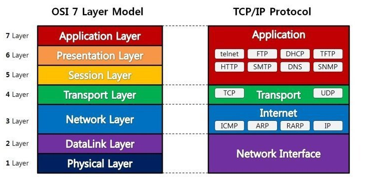
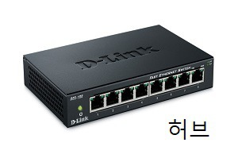

* [출처](https://gyoogle.dev/blog/computer-science/network/OSI%207%EA%B3%84%EC%B8%B5.html)

***

## OSI 7계층
* OSI 7계층이란 컴퓨터 네트워크 프로토콜 디자인과 통신을 계층으로 나누어 설명한 것이다

  

***

1. 물리 계층(Physical Layer)
~~~
물리 계층(Physical layer)은 네트워크의 기본 네트워크 하드웨어 전송 기술을 이룬다. 
비트 0, 1의 통신단위로 통신하며 데이터를 전송하는 역할만 수행한다.
~~~

   

2. 데이터 링크 계층(Data Link Layer)
~~~
물리계층을 통해 송수신되는 정보의 오류와 흐름을 관리하여 안전한 정보의 전달을 수행할 수 있도록 도와주는 역할을 한다. 
Mac주소를 통해 통신하며 프레임에 Mac 주소를 부여하고 에러검출, 재전송, 흐름제어를 진행한다.
Mac주소는 컴퓨터간 데이터를 전송하기 위해 있는 컴퓨터의 물리적 주소이다.
~~~

   

3. 네트워크(Network)
> 라우터, IP
~~~
데이터를 목적지까지 가장 안전하고 빠르게 전달하는 기능을 담당한다.
라우터를 통해 이동할 경로를 선택하여 IP 주소를 지정하고, 해당 경로에 따라 패킷을 전달해준다.
라우팅, 흐름 제어, 오류 제어, 세그먼테이션 등을 수행한다.
~~~

   

4. 전송(Transport)
> TCP, UDP
~~~
TCP와 UDP 프로토콜을 통해 통신을 활성화한다. 
포트를 열어두고, 프로그램들이 전송을 할 수 있도록 제공해준다.
~~~

   

5. 세션(Session)
> API, Socket
~~~
데이터가 통신하기 위한 논리적 연결을 담당한다.
TCP/IP 세션을 만들고 없애는 책임을 지니고 있다.
~~~

   

6. 표현(Presentation)
> JPEG, MPEG 등
~~~
데이터 표현에 대한 독립성을 제공하고 암호화하는 역할을 담당한다.
파일 인코딩, 명령어를 포장, 압축, 암호화한다.
~~~

   

7. 응용(Application)
> HTTP, FTP, DNS 등
~~~
최종 목적지로, 응용 프로세스와 직접 관계하여 일반적인 응용 서비스를 수행한다.
사용자 인터페이스, 전자우편, 데이터베이스 관리 등의 서비스를 제공한다.
~~~