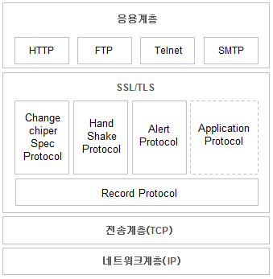

# SSL & TLS
[출처 블로그](https://m.blog.naver.com/xcripts/70122755291)

<br>

## SSL(Secure Socket Layer)
```
SSL이란 보안 소켓 계층을 이르는 것으로, 
인터넷 상에서 데이터를 안전하게 전송하기 위한 인터넷 암호화 통신 프로토콜임.
```

<br> <br>

## TSL (Transport Layer Security)
* SSL은 전자상거래 등의 보안을 위해 넷스케이프에서 처음 개발됨
* SSL이라는 명칭이 특정 회사의 제품 이름 같다하여 **TLS로 표준화** 됨
* TLS는 SSL 3.0을 기반으로 발표되었기 때문에, SSL과 거의 같다고 볼 수 있음
* 현재는 1999년에 처음 발표된 TLS 1.0이 계속 유지되어 오고 있음.
* 참고 : SSL의 변화
    * SSL 1.0 > SSL 2.0 > SSL3.0 > TLS1.0 > RFC 2246(표준규약)

<br> <br>

## SSL의 동작
* SSL 프로토콜은 응용계층과 전송계층 사이에 독립적인 프로토콜 계층을 만들어서 동작함
    

```
응용계층의 프로토콜들은 외부로 보내는 데이터를 TCP가 아닌 SSL에 보내게 되고,
SSL은 받은 데이터를 암호화하여 TCP에 보내어 외부 인터넷으로 전달하게 됨.

전달 받을 때에도 TCP로부터 받은 데이터를 복호화하여 응용계층에 전달하게 되는데,
이 과정에서 Application은 SSL을 TCP로 인식하고, TCP는 SSL을 Application으로 인식하기 때문에,
Application과 TCP사이의 데이터 전달 방식은 기존 전달 방식을 그대로 사용하게 됨.
```

* SSL에 의한 데이터의 이동을 대충 표현하면?
    * 응용계층 -> SSL(암호화) -> TCP -> ... -> SSL(복호화) -> 응용계층

<br> <br>

## SSL(Secure Socket Layer) 통신 절차 
1. 클라이언트가 서버에 접속하면 서버인증서(서버의 공개키를 인증기관이 전자서명으로 인증한 것) 를 전송받음
    * 이때, 클라이언트 인증을 필요로 할 경우 클라이언트의 인증서를 전송하게 됨

<br>

2. 클라이언트는 받은 서버 인증서를 분석하여 신뢰할 수 있는 인증서인지를 검토한 후, 서버의 공개키를 추출.

<br>

3. 클라이언트가 세션키로 사용할 임의의 메세지를 서버의 공개키로 암호화하여 서버에 전송.

<br>

4. 서버에서는 자신의 개인키로 세션키를 복호화하여 그 키를 사용하여 대칭키 암호방식으로
   메시지를 암호화하여 클라이언트와 통신. (`https://`)