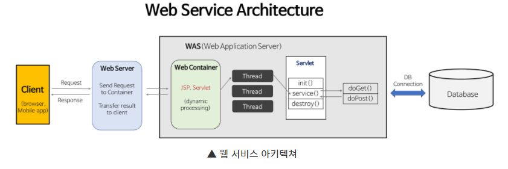

## 웹 서버(Web Server)와 WAS(Web Application Server)

### 웹 서버란
* 클라이언트(웹 브라우저=사용자)로부터 HTTP 요청을 받아 **정적인 컨텐츠**(.html .jpeg .css 등)를 제공하는 서버
* 클라이언트의 동적 컨텐츠 요청을 WAS에 보내고 그 결과를 전달하는 역할도 함
* 대표적인 웹 서버로 **Apache**, **Nginx**가 있음

 

### WAS란
* DB조회나 다양한 로직 처리(반복문 같은...)를 요구하는 **동적인 컨텐츠**를 제공하기 위한 Application Server
* WAS는 Web Server + Web Container로 이루어져 있음
* 웹 컨테이너(Web Container)란 JSP, Servlet을 실행시킬 수 있는 소프트웨어를 말한다.
* 대표적인 WAS로는 **Tomcat**이 있다.

 

### Web Server vs WAS
~~~
위에서 Web Server와 WAS의 큰 차이점으로 정적/동적 컨텐츠의 제공이라고 했지만
해당 목적이 궁극적인 목적은 아니며 Web Server와 WAS의 구성에 따라 다양한 효과를 얻을 수 있다.
~~~

* 웹 서비스 아키텍처 예시 - **Web Server와 WAS의 구성에 따라 달라질 수 있음**

#### Web Server가 왜 필요할까 ?
* Web Server를 통해 정적인 파일들을 WAS까지 가지 않고 앞단에서 빠르게 보내줄 수 있다.
* Web Server에서는 정적 컨텐츠만 처리하도록 기능을 분배하여 서버의 부담을 줄일 수 있다.

 

#### WAS가 왜 필요할까 ?
* 이미지나 HTML이나 css파일 같은 정적파일로는 동적파일을 만들어낼 수 없다.
* 즉, 사용자가 원하는 다양한 요청에 대한 결과값을 미리 만들어 둘 수 없다.
* 따라서 WAS를 통해 요청에 맞는 데이터를 DB에서 가져와서 비즈니스 로직에 맞게 결과를 만들어 제공할 수 있다.

 

#### Web Server와 WAS의 분리 ?
> WAS가 Web Server의 역할을 해줄 수 있지 않을까 ?
* 웹서버와 WAS로 기능을 분리하여 **서버 부하를 방지**
* 물리적으로 분리하여 **보안강화** - SSL에 이용
* 여러대의 WAS를 연결 가능
    * 로드 밸런싱
    * fail over(장애 극복), fail back 처리에 유리
    * 무중단 배포 운영
* 여러 웹 어플리케이션 서비스 가능 - 하나의 웹서버에서 Java서버, C#서버, PHP서버 등을 서비스 가능

 

#### Web 서비스 아키텍처
> Web Server와 WAS의 구성에 따라 아키텍처가 달라질 수 있음

* WAS와 Web Server를 분리하지 않는 경우
    * 웹서버와 WAS의 역할을 동시에 수행
    * 사용자가 적을경우 효과적
* WAS와 Web Server를 분리하는 경우
    * 정적, 동적 데이터처리의 구분
* WAS 여러개와 WebServer를 분리하는 경우
    * 로드밸런싱, 무중단 배포 등

