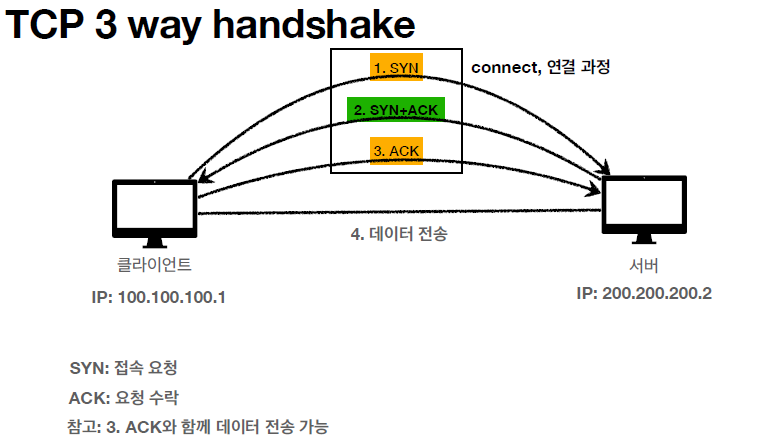
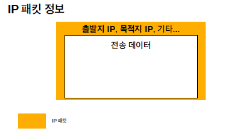
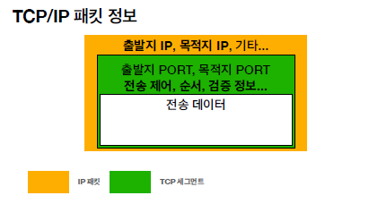
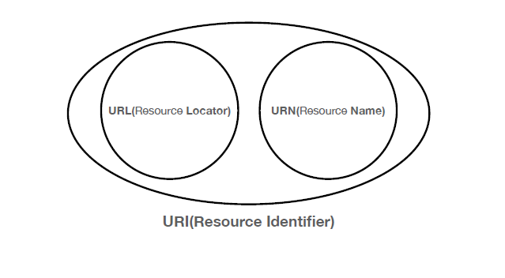
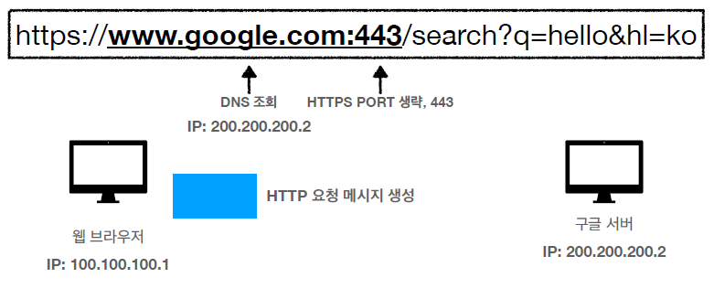
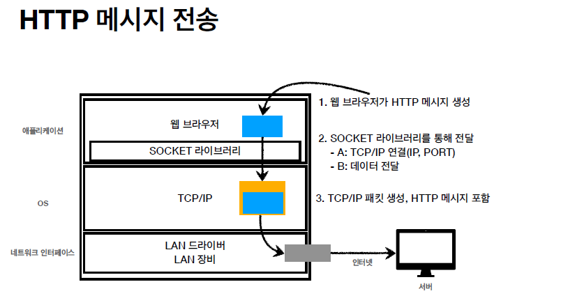

### IP(Internet Protocol)
~~~
인터넷에 연결되어 있는 모든 장치들을 식별할 수 있도록 부여되는 고유 주소
IP를 통해 패킷을 전달할 수 있음
~~~

* IP의 한계
    * 비연결성 : 패킷을 받을 대상이 없거나 서비스 불능 상태여도 패킷 전송
    * 비신뢰성 : 패킷의 순서가 바뀌거나 패킷이 누락될 수 있음
    * 프로그램의 구분 : 같은 IP를 사용하는 서버에서 통신하는 어플리케이션이 둘 이상? (Port 관련)
    * TCP, UDP가 나오게된 계기

   

### TCP (Transmission Control Protocol)
전송 제어 프로토콜 TCP는 인터넷 프로토콜 스위트(IP)의 핵심 프로토콜 중 하나로, IP와 함께 TCP/IP라는 명칭으로도 불림

* 3 way handshake & 4 way handshake
~~~
3way handshake를 통해 클라와 서버를 연결할 수 있음
4way handshake를 통해 연결을 종료 (Fin-> , <-Ack, <-Fin, Ack->)
~~~

* TCP 특징
    * 연결 지향 - 3 way handshake
    * 신뢰할 수 있는 프로토콜 - 데이터 전달 보증, 순서 보장 (패킷안에 관련정보가 있음)
    * HTTP/1.1 , HTTP/2 에서 사용
    * BUT 데이터량이 크고, 전송속도가 UDP에 비해 떨어짐

 

### UDP (User Datagram Protocol)
패킷 순서를 보장하지 못함. IP와 같지만 PORT와 체크섬(오류검출) 정도만 추가됨

* UDP 특징
    * TCP와는 달리 데이터 연결, 데이터 전달, 순서를 보장하지 못함
    * 하얀 도화지와 같음 - 전달 목적에 맞게 최적화 할 수 있음 -> **HTTP/3** 의경우 UDP를 최적화한 버전임
    * IP와 거의 같은데 PORT, 체크섬 정도만 추가됨
    * TCP에 비해 데이터량이 적고 전송속도가 빠름

   

### 패킷 (packet)
~~~
Package(화물)와 Bucket(덩어리)의 합성어로
IP주소로 데이터가 전송될 때 서로 교환되는 실제의 내용물로, 조각조각 분할된 파일 데이터에 주소와 에러 데이터 등이 기록된다.
~~~

   

### PORT 란?
~~~
같은 IP 내에서 프로세스를 구분하기 위해 사용하는것
(브라우저에서 사용중인 포트인지 게임에서 사용중인 포트인지...)
TCP or UDP에서는 출발PORT , 도착PORT가 패킷에 함께 전달되어 사용됨
~~~

   

### DNS (Domain Name System) 란?
~~~
IP는 기억하기 어렵다.
IP는 변경될 수 있다.
따라서 IP를 DNS서버에 도메인명으로 등록하여 사용하는 것임
~~~

   

### URI (Uniform Resource Identifier) 란?
* URL(Resource Locator)
* URN(Resource Name)
* URI(Resource Identifier) : URL + URN

~~~
이름만으로 리소스를 찾는 방법인 URN은 보편화 되어 있지 않으므로 URN은 거의 사용하지 않음
URL을 주로 사용하기 때문에 URL과 URI를 같은 의미로 봐도 무관함
~~~

#### URL 문법
> scheme://[userinfo@]host[:port][/path][?query][#fragment]
> https://www.google.com:443/search?q=hello&hl=ko

* 프로토콜(scheme: `https`)
* 호스트명(host: `www.google.com`)
* 포트 번호(port: `443`)
* 패스(path: `/search`)
* 쿼리 파라미터(query: `q=hello&hl=ko`)
* 자세한 내용은 강의 참고

   

### 웹 브라우저 요청 흐름
`https://www.google.com:443/search?q=hello&hl=ko`와 같은 요청이 오면 어떤 과정을 거치게 될까?

> 아래의 그림과 함께 흐름 파악하기
1. 웹 브라우저가 DNS서버에서 IP를 조회한다.
2. scheme가 https이므로 443포트가 생략되어 있음
3. HTTP요청 메시지를 생성함
4. 조회한 IP와 포트의 위치로 Socket 라이브러리를 통해 HTTP메시지를 전달
5. 전달할 때에는 3way handshake로 TCP/IP연결
6. HTTP메시지를 포함한 TCP/IP 패킷을 생성하여 전달

   

***
   

# -미완-

### HTTP 요청 메시지
4번의 설명중 https://www.google.com:443/search?q=hello&hl=ko 링크를 예로들면
웹 브라우저에 의해 해당 도메인 주소(구글)로 아래와 같은 HTTP요청 메시지를 생성함

GET /search?q=hello&hl=ko HTTP/1.1
Host: www.google.com

   

### 클라이언트 서버 구조
예전에는 클라와 서버가 하나로 뭉쳐있었지만 개념이 분리가 되면서 가능한 것이 많아짐 - 역할과 책임의 분리 ex) 백엔드, 프론트엔드

클라이언트에는 UI와 사용성에 대해 집중할 수 있고
서버에서는 비즈니스로직과 데이터에 대해서 집중할 수 있게 됨
즉, 클라이언트와 서버를 나눔으로써 각각 독립적으로 관리할 수 있음

Request, Response구조로 클라는 서버에 요청을 보내고 서버가 요청에 대한 결과를 만들어서 응답을 하는 방식임

   

### 7. 무상태 프로토콜 : Stateless
서버가 클라이언트의 상태를 보존하지 않음

   

### 8. 멱등성, 안전함
[멱등성 참고링크](https://developer.mozilla.org/ko/docs/Glossary/Idempotent)
[안전함 참고링크](https://developer.mozilla.org/ko/docs/Glossary/Safe)

~~~
동일한 요청을 한 번 보내는 것과 여러 번 연속으로 보내는 것이 같은 효과를 지니고,
서버의 상태도 동일하게 남을 때, 해당 HTTP 메서드가 멱등성을 가졌다고 말합니다. 
~~~

**멱등성**
* GET, PUT, DELETE 멱등함 -> 특정 요청성공시 매번 같은 결과
* POST , PATCH는 멱등하지 않음 
    * POST : 특정 POST요청을 계속하면 계속해서 데이터가 추가됨
    * PATCH : 멱등하게 설계할 수도 있지만, 특정값에 +10을 하는 요청이라면 요청 반복시 결과가 계속해서 변경됨

**안전함**
* GET 안전함
* PUT, DELETE는 멱등하지만 안전하지 않음
