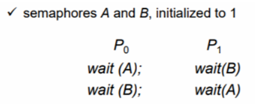

[참고 블로그](https://jhnyang.tistory.com/2)

## 데드락 (Deadlock)
~~~
데드락(교착상태)이란 시스템 자원에 대한 요구가 뒤엉킨 상태이다.
즉, 둘 이상의 프로세스가 다른 프로세스가 점유하고 있는 자원을 서로 기다릴 때 
무한 대기에 빠지는 상황을 나타낸다.
~~~

* 다양한 유형의 자원을 대상으로 경쟁하는 여러 프로세스들 때문에 발생하는 문제이다.
* 운영체제에서 대부분의 교착상태는 세마포어를 차지하려는 경쟁에서 발생한다.

 

### 데드락이 생기는 과정
*  A와 B는 공유자원이고 P0과 P1은 프로세스

1. 프로세스 P0이 A자원에 세마포어를 가진 상태에서 **인터럽트**가 걸린다.
2. P1으로 **Context Switching**이 되고 P0는 wait(A)상태로 바뀐다.
3. P1이 자원B에 세마포어를 걸어 공유자원B를 확보
4. P1이 A를 확보하려고 하지만 P0이 사용중이라 기다려야 함
5. P0은 wait(A)까지 수행되고 인터럽트가 걸렸으니까 B를 확보해야 할 차례지만 P1이 사용중이니 대기
6. P0과 P1이 서로가 가지고 있는 자원을 기다리게 되는 **교착상태**에 빠지게 됨

 

### 데드락의 발생조건 (Necessary Conditions)
필요조건이므로 데드락이 발생하면 아래의 조건들을 모두 만족하지만,
아래 조건들을 모두 만족한다고 해서 꼭 데드락이 일어나는것은 아님.

1. 상호 배제 (Mutual Exclusion)
동기화를 만족시키기 위한 조건과 같다. 
하나의 프로세스가 자원을 사용할 경우 다른 프로세스는 그 자원을 사용할 수 없는 것을 의미

2. 점유와 대기 (Hold and wait)
프로세스가 이미 어떤 자원을 점유하고 있으면서 다른 종류의 자원을 요구하는 것을 의미

3. 비선점 (No preemption)
임의의 프로세스가 자원을 할당 받은 상태에서 다른 프로세스가 이 자원을 뺏어서 사용할 수 없는 형태를 의미

4. 환형대기 (circle wait)
프로세스와 자원들이 원형을 이루며, 
각 프로세스는 자신에게 할당된 자원을 가지면서 상대방 프로세스의 자원을 상호 요청하는 경우를 의미

 

### 데드락의 해결방법
1. 예방 (prevention)
위의 데드락 발생조건 4가지 중 하나라도 발생하지 않도록 사전에 예방

2. 회피 (avoidance)
데드락이 빠질 가능성이 있는지 없는지 운영체제가 검사하고 괜찮은 경우만 자원을 할당하여 데드락을 회피
ex) 은행원 알고리즘

3. 탐지 (Detection)
교착상태 발생을 허용하고 발생시 원인을 규명하여 해결
ex) 자원할당 그래프

4. 회복 (recovery)
교착상태 프로세스들을 모두 중지 또는 교착상태가 해결될 때까지 프로세스 하나씩 중지(환형대기 배제)

5. 무시 (Do Nothing, ignore)
운영체제가 교착상태를 무시함. 개발자가 데드락에 빠질 가능성이 없도록 프로그램을 설계해야 함

 

### 은행원 알고리즘, 자원할당 그래프
`생략...`
