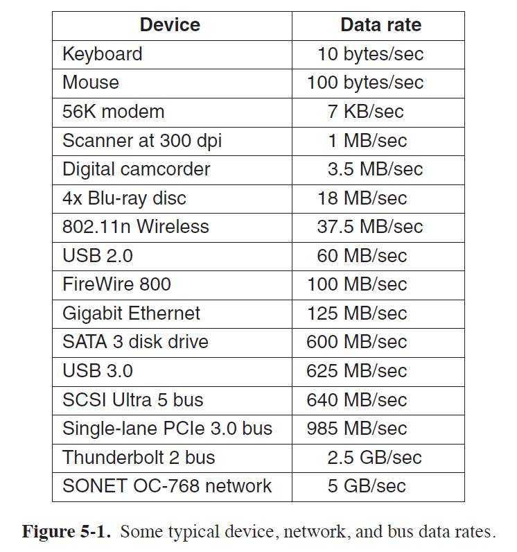
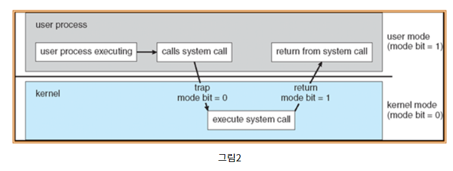
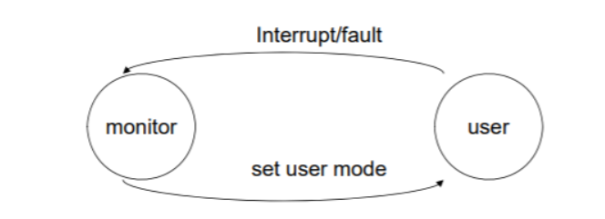
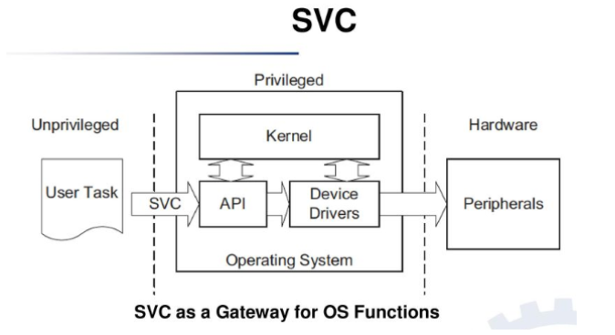

## I/O System, 유저모드/커널모드, 인터럽트
[참고 블로그1](https://jhnyang.tistory.com/190)
[참고 블로그2](https://mns010.tistory.com/12)
[참고 블로그3](https://mns010.tistory.com/13)
[출처 블로그4](https://raisonde.tistory.com/entry/인터럽트Interrupt의-개념과-종류)
[위키 백과](https://ko.wikipedia.org/wiki/%EC%9D%B8%ED%84%B0%EB%9F%BD%ED%8A%B8)

 

***

## I/O System ?
* I/O System은 OS code의 대부분을 차지하는 복잡한 System중 하나이다.
* User의 체감 성능에 가장 중요한 영향을 미치는 것이 I/O System의 Performance이다.

- OS에는 위와 같은 다양한 종류의 **I/O Device**들에 대한 Driver가 전부 구현되어 있어야 한다.
- 그렇기 때문에, OS Code의 대부분은 I/O와 관련된 내용들인 것이다.

 

***

## Kernel mode & User mode
* **CPU**에는 유저모드(User mode)와 모니터모드(Monitor mode) 두가지가 있음
* Monitor mode, Supervisor mode, System mode, Kernel mode 4가지는 같은 의미로 쓰임
* 일반적으로 커널모드(Kernel mode)라고 불림

 

### User/Kernel 두가지 모드가 있는 이유 ?
* I/O 장치를 보호하기 위함 (I/O protection)
* 중요한 데이터를 보호하기 위해 I/O장치에 직접 접근할 수 없게 하고 운영체제를 통해서만 I/O에 접근하도록 함

 

### User/Kernel 모드의 구분
* 모드 비트(mode bit)라는것이 있는데 보통 1이면 유저모드, 0이면 커널모드를 가리킨다.

* 아래의 그림처럼 무한루프를 도는데 유저/커널 모드를 왔다갔다 하면서 루프를 돈다.
* 코드에서는 유저모드에서 무한루프를 돌다가 프로그램 수행도중 인터럽트가 걸리면 커널모드로 전환되며 운영체제가 작업을 수행

 

### User/Kernel 모드 특징, System call이란 ?
**커널모드**
* 시스템의 모든 메모리에 접근가능하며 CPU명령을 실행할 수 있다.
* 운영체제 코드나 디바이스 드라이버 같은 커널모드 코드를 실행한다.
* CPU의 제어권을 가지고 명령을 수행하는 모드로 `일반 명령`과 `특권 명령` 모두 수행할 수 있다.

**유저모드**
* 사용자 애플리케이션 코드가 실행한다.
* 시스템 데이터에는 접근만 허용되며 하드웨어에는 직접 접근이 불가하다.
* 일반 사용자 프로그램이 CPU제어권을 가지고 명령을 수행하는 모드이기 때문에 `일반 명령`만을 수행할 수 있다.
* 대신 유저 애플리케이션은 **System call**을 이용하여 `특권 명령`을 대신 수행하도록 요청할 수 있으며
이때 유저모드에서 커널모드로 전환된다.

 

***

# 인터럽트
~~~
입출력 하드웨어 등의 장치에 예외상황이 발생하여 처리가 필요할 경우에 
마이크로프로세서에게 알려 처리할 수 있도록 하는 것
~~~

***

## 인터럽트 종류
* 외부 인터럽트
* 내부 인터럽트
* 소프트웨어 인터럽트(SVC)

 

### 외부 인터럽트
* 전원 이상 인터럽트(Power fail interrupt) : 말그대로 정전, 파워 이상 등
* 기계 착오 인터럽트(Machine check interrupt) : CPU의 기능적인 오류
* 외부 신호 인터럽트(External interrupt)
    - 타이머에 의한 인터럽트 : Preemptive개념을 생각하면 된다. 자원이 할당된 시간이 다 끝난 경우
    - 키보드로 인터럽트 키를 누른 경우 : 대표적으로 Control + Alt + Delete
    - 외부장치로부터 인터럽트 요청이 있는 경우 : I/O 인터럽트 아님!! 다른 개념이다
* 입출력 인터럽트(I/O Interrupt)
    - 입출력장치가 데이터 전송을 요구하거나 전송이 끝나 다음 동작이 수행되어야 할 경우
    - 입출력 데이터에 이상이 있는 경우

 

### 내부 인터럽트(Exception 인터럽트)
* Exception인터럽트 라고 불린다.
* 잘못된 명령이나 잘못된 데이터를 사용할때 발생하며 
운영체제한테 도움을 요청하기 위해 자신에게 인터럽트를 거는데 이를 **Trap**이라 부른다.
* 프로그램 검사 인터럽트(Program check interrupt) 예시
    - Division by zero
    - Overflow/Underflow
    - 기타 Exception
* 소프트웨어적이 내용이나 분류상 인터럽트가 아니다!

 

### 소프트웨어 인터럽트 (SVC : SuperVisor Call)
* 소프트웨어 인터럽트중 대표적으로 SVC가 있다.
* 사용자가 프로그램을 실행시키거나 감시프로그램(Supervisor = 운영체제)을 호출하는 동작을 수행하는 경우 인터럽트가 발생할 수 있다.
* SVC에 의해 I/O protection이 수행될 수 있다.
* 소프트웨어 이용중 다른 프로세스를 실행시키면 시분할 처리를 위해 자원 할당 등의 동작이 수행된다.

 

***

## 인터럽트 과정
> 인터럽트 과정을 이해하기 위해 필요한 용어들 먼저 살펴보자.

 

### 인터럽트 핸들러
* ISR(Interrupt Service Routine)이라고도 함

~~~
인터럽트가 발생하면 이를 핸들링하기 위한 함수가 호출되는데 이를 인터럽트 핸들러라고 한다.
예를 들어, 키보드 자판을 눌러서 인터럽트가 발생하면 키보드 인터럽트를 처리하는 키보드 인터럽트 핸들러가 호출된다. 
마찬가지로 스마트폰에서 화면을 손으로 만지면 터치 인터럽트가 발생하고,
터치 인터럽트를 처리하는 터치 인터럽트 핸들러가 호출된다.

즉, 인터럽트 핸들러란 인터럽트를 처리하기 위한 루틴이며 "인터럽트 서비스 루틴(ISR)"이라고도 한다.
운영체제의 코드 영역에는 인터럽트별로 처리해야할 내용이 이미 프로그램되어 있다.
~~~

 

### 인터럽트 벡터
~~~
인터럽드 발생시 처리해야 할 인터럽트 핸들러의 주소를 
인터럽트 별로 보관하고 있는 테이블이다.
~~~

 

### PCB(Process Control Block)
~~~
커널의 데이터 영역에 존재하며 각각의 프로세스마다 고유의 PCB가 있다.
인터럽트 발생 시 프로세스의 어느 부분이 수행중이었는지를 저장한다.
(수행중이던 memory 주소, 레지스터값, 하드웨어 상태 등등)
~~~

 

### 프로그램 카운터(PC)
~~~
프로그램 카운터(Program counter, PC)는 마이크로프로세서(중앙 처리 장치) 내부에 있는 레지스터 중의 하나로서, 
다음에 실행될 명령어의 주소를 가지고 있어 실행할 "기계어 코드의 위치를 지정"한다. 
때문에 명령어 포인터라고도 한다.
~~~

 

### 인터럽트 과정
> 인터럽트 원천인 하드웨어에서 또는 예외상황이 발생하거나 소프트웨어 인터럽트가 걸리면...

1. 현재 진행 중인 기계어 코드를 완료한다.
2. CPU의 특수레지스터 중, 하이로인터럽트 마스크 비트를 보고 마스크 되면 인터럽트 무시 한다.
3. 인터럽트 벡터를 읽고
4. ISR 주소값을 얻는다.
5. ISR로 점프 한다. 이때 PC(Program Counter, IP) 값은 자동 대피 저장된다.
6. 현재 진행중인 프로그램의 레지스터를 대피한다.
7. 해당 코드를 실행한다.
8. 해당 일을 다 처리하면, 대피시킨 레지스터를 복원한다.
9. ISR의 끝에 IRET(Interrupt Return) 명령어에 의해 인터럽트가 해제 된다.
10. IRET 명령어가 실행되면, 대피시킨 PC 값을 복원하여 이전 실행 위치로 복원한다.

 

### 인터럽트 우선순위...?
`생략...`