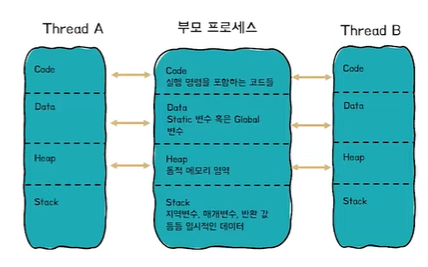

# 프로세스와 스레드

*******

### 프로세스란 ?
> 실행 중인 프로그램(program).

즉, 사용자가 작성한 프로그램이 운영체제에 의해 메모리 공간을 할당받아 실행 중인 것을 말함.
이러한 프로세스는 프로그램에 사용되는 데이터와 메모리 등의 자원 그리고 스레드로 구성됨

 

### 스레드란 ?
스레드(thread)란 프로세스(process) 내에서 실제로 작업을 수행하는 주체를 의미.
모든 프로세스에는 한 개 이상의 스레드가 존재하여 작업을 수행.
또한, 두 개 이상의 스레드를 가지는 **프로세스**는 **멀티스레드 프로세스(multi-threaded process)** 라고 함.

 

### 쓰레드와 프로세스의 차이점
프로세스는 완벽히 독립적이기 때문에 메모리 영역(Code, Data, Heap, Stack)을 다른 프로세스와 공유를 하지 않지만, 
쓰레드는 해당 쓰레드를 위한 스택을 생성할 뿐 그 이외의 Code, Data, Heap영역을 공유한다.

 

### 멀티프로세스와 멀티스레드
둘 모두 **처리방식의 일종임**
두 방법은 동시에 여러 작업을 수행하는 점에서 동일하지만
각각의 장단이 있으므로 적용하는 시스템에 따라 적합한 동작 방식을 선택하고 적용해야 함.

* 멀티 스레드
장점 : 적은 메모리 공간을 차지하고 **Context Switching이 빠르다**
단점 : 동기화 문제와 하나의 스레드 장애로 전체 스레드가 종료 될 위험을 갖고 있음

 

* 멀티 프로세스
장점 : 하나의 프로세스가 죽더라도 다른 프로세스에 영향을 주지 않아 **안정성이 높음**
단점 : 멀티 스레드보다 많은 메모리공간과 CPU 시간을 차지함

### 6. PCB, Context Switching
CPU는 한번에 하나의 프로세스(or 쓰레드)만 실행 가능하다.
CPU에서 여러 실행단위를 돌아가면서 작업을 처리하는 데 이 과정을 **Context Switching**라 한다.
더 자세히 이해하기 위해서는 PCB가 뭔지 알아야 함.

**PCB(Process Control Block)** 란 운영체제가 프로세스에 대한 중요한 정보를 저장해 놓을 수 있는 저장 장소이다.
프로세스의 ID, 상태(준비, 대기, 실행 등), 레지스터정보, 스케줄링 우선순위등이 저장된다.

**Context Switching** 이란
CPU가 이전의 프로세스 상태를 PCB에 보관하고, 또 다른 프로세스의 정보를 PCB에서 읽어
레지스터에 적재하는 과정을 말한다.

인터럽트가 발생하거나
실행중인 프로세스가 CPU사용을 허가받은 시간(Time Quantum)을 모두 소모하거나
I/O 입출력을 위해 대기해야 하는 경우에
Context Switching이 발생한다.
즉, 프로세스가 준비->실행, 실행->준비, 실행->대기 등으로 **상태가 변경될때** 일어난다.

