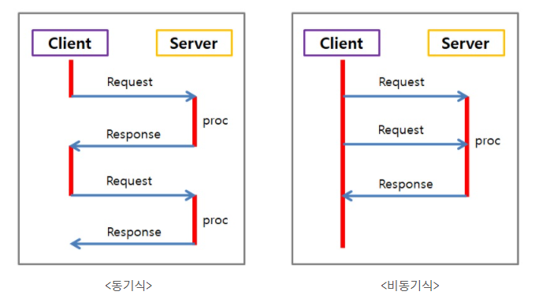
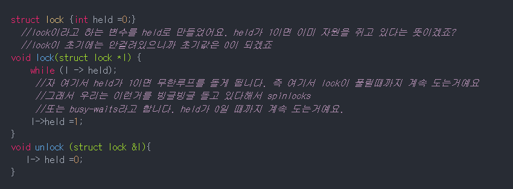
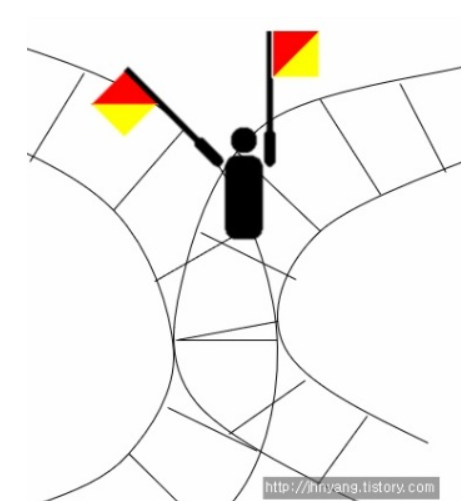
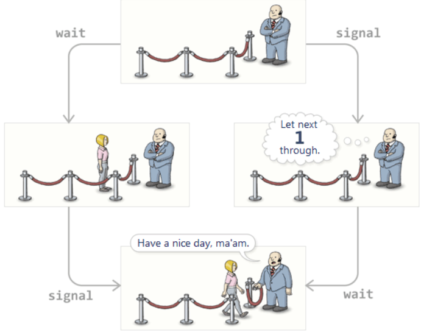

## 동기화 (Synchronization)
프로세스 또는 스레드들이 수행되는 시점을 조절하는 것을 **동기화**라고 한다

멀티 프로세스이 되었던, 멀티 스레드가 되었던 간에 어떤 **공유된 자원**을 접근하는 경우 그들의 순서를 조절해야 하기때문

* [참고 블로그 1](https://jhnyang.tistory.com/notice/31) 
* [참고 블로그 2](https://about-myeong.tistory.com/34) 

 

### 동기와 비동기 차이

 

***

### 임계영역 (Critical Section)
~~~
프로세스 간에 동시에 접근하려고 하는 공유자원에서 문제가 발생하지 않도록
한번에 하나의 프로세스만 이용하게끔 공유자원의 독점을 보장하는 코드 영역
~~~

 

### Lock 이란 ?
~~~
이름 그대로 걸어 잠군다는 뜻임
스레드가 어떠한 자원을 사용하고 있는 동안 Lock을 걸면 다른 스레드가 접근하지 못하게 함
~~~

**busy-waits**

**Spin Lock**
~~~
Spin Lock은, 만약 다른 스레드가 lock을 소유하고 있다면 그 lock이 반환될 때까지 계속 확인하며 기다리는 것이다.
위의 그림에서는 while문에 해당함
~~~

 

**Lock 방법의 문제**
~~~
Lock을 확인하기 위한 변수(위 코드에서는 held)가 Critical Section이 되어 동시 접근을 허용하는 문제가 발생함
held가 0으로 바뀔때 대기하던 프로세스가 Critical Section에 들어오고 그 시점에 인터럽트가 발생하여 동시 접근을 허용하는 것임
이러한 문제를 해결하기 위하여 **임계영역 해결조건**이 있으며 이를 충족하는 3가지 해결책이 잘 알려져 있음
~~~

 

***

### 임계영역 해결조건 (Requirements for Critical Section)
~~~
1. Mutual Exclusion(상호 배제)
한 프로세스가 공유 자원을 접근하는 임계영역 코드를 수행하고 있으면 
다른 프로세스들은 공유 자원을 접근하는 임계영역 코드를 수행할 수 없다

2. Progress(진행)
임계영역에 어떤 스레드의 접근도 없을때, 항상 접근이 가능해야 함

3. Bounded Waiting(한정된 대기)
프로세스가 Critical Section 에 진입 신청 후 부터 받아들여질 때가지, 다른 프로세스들이 Critical Section 에 진입하는 횟수는 제한이 있어야 한다
즉, 무한정 대기가 없어야 함
~~~

 

### 프로세스 동기화와 Lock문제의 해결책
1. 소프트웨어적 방법 (코드개선)
    * `피터슨 알고리즘(Peterson's Solution)`
2. 하드웨어 명령어 이용 (하드웨어 명령어 API)
    * `test_and_set`
    * `compare_and_swap`
3. 세마포어(Semaphore) / 뮤텍스(Mutex) / 모니터(Monitor)

위의 3가지 해결책은 임계영역 해결조건을 만족함

요즘에는 1번 방법을 잘 쓰지 않고 2,3번 방법을 주로 이용하여 동기화 문제를 해결함

 

***

### 세마포어 (Semaphore)
* 리소스의 상태를 나타내는 카운터
* 세마포어는 깃발이라는 뜻
* 아래의 그림에서는 겹치는 기찻길이 critical section
* 그림에서 깃발(세마포어)은 critical section을 지나가도 되는지 안되는지 알려주는 역할을 함

세마포어는 `Binary Semaphore`, `Counting Semaphore` 2가지가 있음

#### Binary Semaphore
~~~
세마포어가 0또는 1의 값만 가짐
Lock과 다른점은 세마포어는 깃발이기 때문에 사용가능한지 여부를 나타냄
1이라면 사용가능하다는 뜻. Lock은 반대로 사용중일때 1로 나타냄
~~~

 

#### Counting Semaphore
~~~
세마포어가 1이상의 값을 가짐
예를들어 프린터가 5대 있다면 세마포어의 초기값은 5, 한대씩 사용할때마다 하나씩 감소하는 것임
따라서 세마포어는 "공유자원의 개수를 나타내는 변수"라고 볼 수 있음
~~~

 

#### semaphore 접근함수 - wait(), signal()
~~~
Lock의 문제점에서와 같이 세마포어 자체가 공유자원이 되면 안되기 때문에 atomic하게 구현되어야 한다
이것은 **프로세스 동기화와 Lock문제의 해결책**에서 2번째 방법인 하드웨어 명령어를 이용하여 해결한다
위 내용을 구현하기 위해 제공되는 함수가 wait(), signal()이다.

세마포어가 0일때 공유자원에 접근하는 프로세스가 있다면 wait()함수가 수행되고
다 사용하여 접근이 다시 가능한 상태일때, 기다리는 프로세스가 있다면 signal()함수를 수행하여 알려줄 수 있다
~~~

 

### 세마포어(Semaphore) / 뮤텍스(Mutex) / 모니터(Monitor)
* 공통점 : 운영체제의 동기화 기법
* 세마포어와 뮤텍스,모니터와의 차이점
    * 뮤텍스, 모니터는 상호배제를 함으로써 임계구역에 하나의 스레드만 들어갈 수 있음 (binary semaphore와 유사)
    * 세마포어는 하나의 스레드만 들어가게 할 수도 있고(binary) 여러개의 스레드가 들어갈 수도 있다(counting)
* 뮤텍스와 모니터의 차이점
    * 뮤텍스는 다른 프로세스간의 동기화 처리
    * 모니터는 하나의 프로세스내의 스레드간의 동기화 처리
    * 따라서 뮤텍스는 무겁고(heavy-weight) 느리며(slower) 모니터는 가볍고(light-weight) 빠르다(faster).
* 세마포어와 모니터의 차이점
    * 모니터는 공유자원에 접근하기 위한 키 획득과 자원 사용 후 해제를 모두 처리한다 (예시- java의 synchronized)
    * 세마포어는 **직접 키 해제와 공유자원 접근 처리**가 필요하다
    * Java에서는 모니터를 기본적으로 제공, C는 사용불가

 

***

