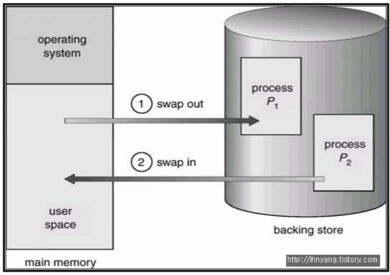
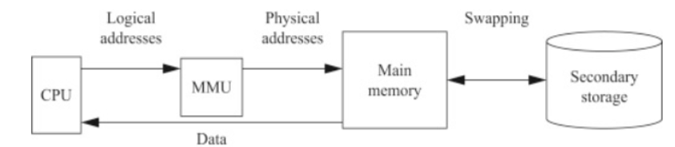
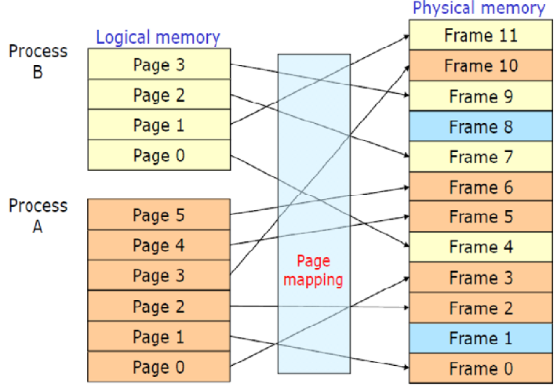
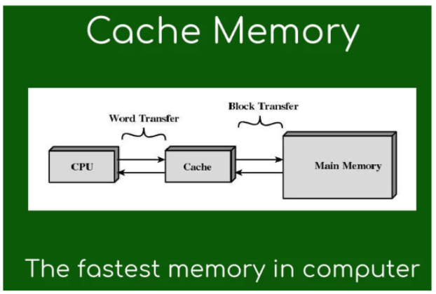
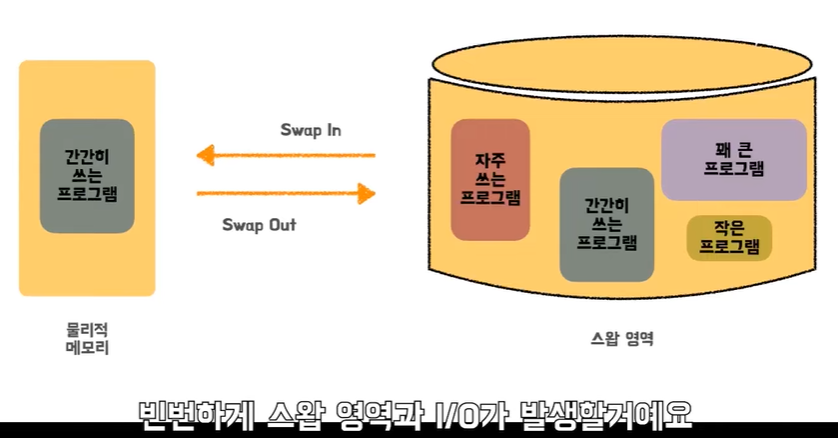
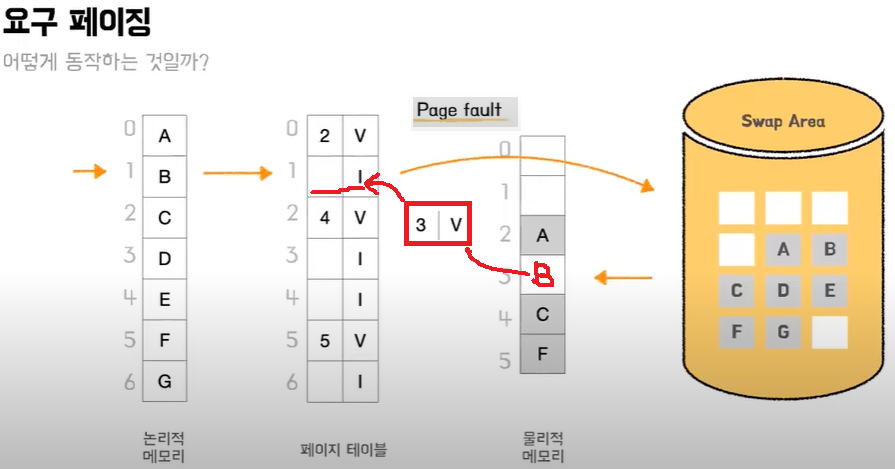

[참고 블로그](https://jhnyang.tistory.com/notice/31)
[참고 영상](https://www.youtube.com/watch?v=5pEDL6c--_k)

 

### 스와핑(Swapping)
주기억장치(Main Memory)에 적재한 하나의 프로세스와 보조기억장치에 적재한 다른 프로세스의 메모리를 교체하는 기법

여러개의 프로그램이 메모리에 올라오거나 메모리보다 큰 프로그램이 메모리로 올 경우 공간이 부족해진다.

따라서 메모리 공간의 확장 영역으로 swap area를 사용한다. (사진에서는 backing store)

스왑메모리는 외부저장장치에 존재하지만 메인메모리의 확장 개념이다.

스왑메모리는 외부저장장치에 존재하므로 OS에 의해 I/O작업이 일어난다.

* Swap Out : 주기억장치 -> 보조기억장치
* Swap In : 보조기억장치 -> 주기억장치

 

### MMU(Memory Management Unit)
MMU는 CPU코어 안에 탑재되어 가상 주소(Logical Memory)를 실제 메모리 주소(Physical address)로 변환해주는 장치이다.

* 그림에서는 CPU와 MMU가 나눠져 있지만, MMU는 CPU에 탑재되어 있음에 주의

  

### TLB(Translation Lookaside Buffer)
페이징(Paging)에서 아래의 그림처럼 페이지와 프레임을 mapping을 위해서 Page Table이 필요하다.

그런데 페이지 테이블의 문제는 크기가 크다는 것이다.

메모리 주소변환을 MMU가 하는데 Page Table의 크기는 MMU에 들어갈 수 없는 크기인것.

메인 메모리에 두자니 메인메모리에 있는 주소를 알기위해 메인메모리에 한번 더 접근하게 되는 비효율적인 문제가 발생

이러한 문제는 **cache memory**에 필요한 page에 대한 정보를 두어 해결하는데 이러한 캐시를 TLB(Translation Lookaside Buffer) 이라고 함

 

***

## 가상 메모리 (Virtual Memory)
메모리 관리 기법중 하나로

프로세스 전체가 메모리 내에 올라오지 않더라도 실행이 가능하도록 하는 기법

물리 메모리 크기의 한계를 극복하기 위해 나온 기술이다.

 

### 가상 메모리 장점
1. 사용자 프로그램이 물리 메모리의 제약에서 벗어남
사용자 프로그램이 물리 메모리보다 커져도 됨
프로그래머는 물리메모리 크기를 신경쓰지 않아도 됨, OS가 알아서 관리

2. 각 프로그램이 더 작은 메모리를 차지하기 때문에 더 많은 프로그램을 동시수행 가능
프로세스당 메모리 사용량이 감소하므로 더 많은 프로세스를 수용 가능

3. 프로그램을 메모리에 올리고 swap하는데 필요한 IO 횟수가 줄어듦
Swap In, Swap Out이 적게 일어나므로 더 빨리 실행가능

 

### 가상 메모리 배경
메인 메모리의 공간이 부족하면 빈번하게 swapping과 입출력(I/O)이 이루어짐

메인 메모리보다 큰 프로세스라면 처리하기 까다로움

따라서 프로세스 전체를 메모리에 적재시킬 필요 없이

**필요한 부분만 메모리에 적재하여 메모리를 효과적으로 관리**하는 방법을 고안해 냄

 

### 요구 페이징 기법(Demand Paging)
프로세스에서 **필요한 페이지**만 메모리에 적재하여 메모리의 낭비를 막고 

필요한 프로세스들을 모두 메인 메모리에서 실행을 시킬 수 있도록 고안한 기법

* Valid & Invalid Bit
    * Valid : 해당 페이지가 메모리에 있음을 나타냄
    * Invalid : 해당 페이지가 메모리에 없음을 나타냄 -> Page fault
    * Page fault : 지금 실행시켜야 할 Page가 실제 메모리에 올라와 있지 않는 것

***

 

### 페이지 교체 알고리즘
* OPT - Optimal : 앞으로 가장 오랫동안 사용되지 않을 페이지 교체
* FIFO - First In First Out : 큐와 같은 동작방식
* LRU - Least Recently Used : 가장 오랫동안 사용되지 않은 페이지 교체
* LFU - Least Frequently Used : 참조 횟수가 가장 작은 페이지 교체
* MFU - Most Frequently used : 참조 횟수가 가장 많은 페이지 교체
* NUR - Not Used Recently : 최근에 사용하지 않은 페이지 교체

[해당 내용은 블로그 참고](https://doh-an.tistory.com/28)