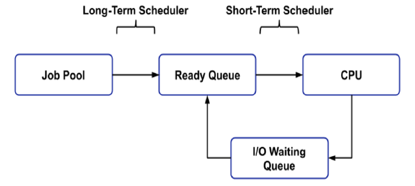

## 스케줄러
[스케줄러 종류 참고 링크](https://jhnyang.tistory.com/372)
[스케줄링 알고리즘 참고 링크](https://hyunah030.tistory.com/4)

***

### 스케줄러(Scheduler) 란?
각 프로세스들의 순서나 일정을 조정해주는 프로그램을 말한다.
프로세스들을 스케줄링 하기위해서 Queue가 존재한다.
Queue는 Linked List로 구현되어 있으며 PCB를 가리키는 포인터를 가지고 있다.
큐의 종류는 아래와 같다.

* Job Queue : 프로세스가 처음 들어와서 대기하는 큐
* Ready Queue : 현재 메모리에 적재되어 실행되기를 기다리는 프로세스를 유지하는 큐
* Device Queue : Device I/O 작업을 대기하는 큐

스케줄러는 이러한 큐에 프로세스들을 적재하기 위해 프로세스를 선별하는 역할을 한다.

 

***

### 스케줄러의 종류
과거에는 스케줄러의 종류에는 총 3가지가 있었다.
> 지금은 virtual memory management가 발달되어 장기 스케줄러가 없기 때문에 따로 구분하지 않는다.
1. Long-Term Scheduler 장기 스케줄러
2. Short-Term Scheduler 단기 스케줄러
3. Medium-Term Scheduler 중기 스케줄러

#### 장기 스케줄러 (Long-Term Scheduler)
장기 스케줄러는 Job Queue로부터 프로세스들을 선별하고 실행을 위해 Ready Queue에 적재하는 역할을 한다.
따라서 **job scheduler** 라고도 불린다.

하지만 지금은 가상메모리 발달로 인해 없어진 개념이다.

 

#### 단기 스케줄러 (Short-Term Scheduler)
실제로 CPU가 실행하는 프로세스는 하나이다.
따라서 장기 스케줄러에 의해 실행할 프로세스를 Ready Queue에 적재했다면 
이중에서 실제로 실행될 프로세스 하나를 선별하는 역할을 단기 스케줄러가 수행한다.
따라서 **CPU scheduler** 라고도 불린다.

 

#### 중기 스케줄러 (Medium-Term Scheduler)
장기,단기 스케줄러가 생긴 이후 생긴 스케줄러지만
장기 스케줄러와 마찬가지로 가상메모리 발달 이후 지금의 운영체제에 없는 개념이다.

중기 스케줄러는 CPU를 사용하려는 프로세스를 중재 즉, 여유공간을 마련하기 위해서
우선순위가 낮은 프로세스들을 선별하여 메모리에서 내리는 역할을 수행한다.
**Swapper** 라고도 불린다.

 

***

### CPU 스케줄링 알고리즘
[자세한 설명 참고링크](https://hyunah030.tistory.com/4)

* 비선점 스케줄링(Non-preemptive scheduling)
    * FCFS (First Come First Served)
    * SJF (Shortest Job First)
* 선점 스케줄링(Preemptive scheduling) : `높은 우선순위를 가지는 프로세스는 항상 먼저 스케줄되어야 한다.`
    * SRT(Shortest Remaining Time)
    * RR(Round Robin)
* 우선 순위 스케줄링(Priority Scheduling)

 

#### CPU 스케줄링 알고리즘의 목적
No starvation : 각각의 프로세스들이 오랜시간동안 CPU를 할당받지 못하는 상황이 없도록 한다.
Fairness : 각각의 프로세스에 공평하게 CPU를 할당해준다.
Balance : Keeping all parts of the system busy

 

#### 1. 선점/비선점 스케줄링?
이미 할당된 자원을 다른 프로세스가 강탈할수 있는지 없는지에 대해 차이가 있다.
비선점 스케줄링은 이미 진행중인 프로세스가 있으면 중간에 다른 프로세스를 할당할 수 없다.
반면 선점 스케줄링방식은 우선순위에 따라 진행중인 프로세스를 sleep시킨 후 더 높은 우선순위의 프로세스에 자원을 할당할 수 있다.

 

#### 2. FCFS(First Come First Served)
먼저 들어온 프로세스를 가장 먼저 처리하는 방식이다.
따라서 FIFO 자료구조인 큐를 사용한다.
장점 : 공평성 유지, 무기한 기다림이 없다.
단점 : [이동 경로가 길어짐](https://jhnyang.tistory.com/104), CPU를 요청하는 프로세스의 burst time에 따라서 평균 waiting time이 나빠짐

 

#### 3. SJF(Shortest Job First)
평균 waiting time을 최소화 하기 위해 사용하는 방식이다.
burst time이 짧은 프로세스부터 CPU를 할당한다.
장점 : waiting time을 최소화
단점 : burst time이 긴 프로세스는 오랜시간동안 CPU를 할당받지 못함(No starvation을 어김)

 

#### 4. SRT(Shortest Remaining Time)
최단 잔여시간을 우선으로 하는 스케줄링이다.
진행 중인 프로세스가 있어도, 최단 잔여시간인 프로세스를 위해 sleep시키고 짧은 프로세스를 먼저 할당한다.
따라서 선점형 SJF 스케줄링이라 불린다.

 

#### 5. RR(Round Robin)
각각의 프로세스가 공평한 시간 간격 동안 CPU를 할당받을 수 있도록 하는 스케줄링 알고리즘이다.
여기서 실행의 최소 단위 시간 간격을 Time Quantum(= time slice) 이라고 하며
정해진 시간 간격이 끝나면(time slice burst), CPU를 사용하고 있던 프로세스는 선점적으로 추방당한다.
즉, 해당큐는 레디 큐에 다시 들어가게 되어 큐의 끝으로 이동한다.

* 알고리즘의 성능은 Time slice 크기와 같아진다. (waiting time관련)
    * Time slice 가 심하게 크다면 FCFS와 다를게 없다.
    * Time slice 가 너무 작다면 불필요한 Context Switch가 많이 일어난다.

 

#### 6. 우선 순위 스케줄링(Priority Scheduling)
* 우선 순위가 높은 프로세스에 CPU를 우선 할당하는 방식의 스케줄링
* 우선 순위는 시간 제한, 메모리 요구량, 프로세스의 중요성, 자원사용 비용 등에 따라 달라질 수 있다.
* 우선 순위가 같을 경우, FCFS와 다를게 없다. (비선점, 선점 둘다 사용된다.)